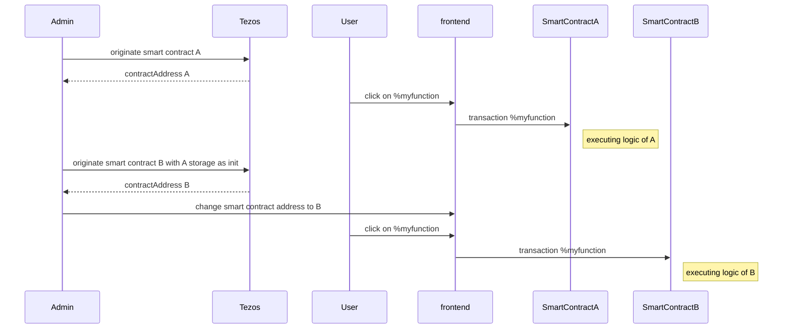
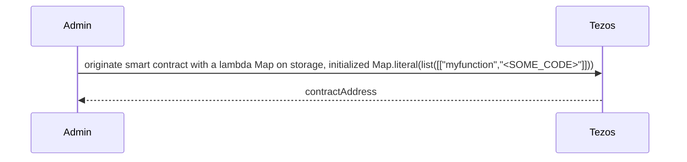
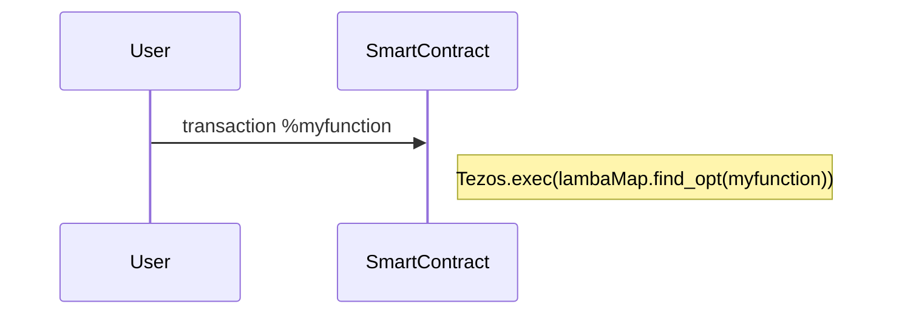
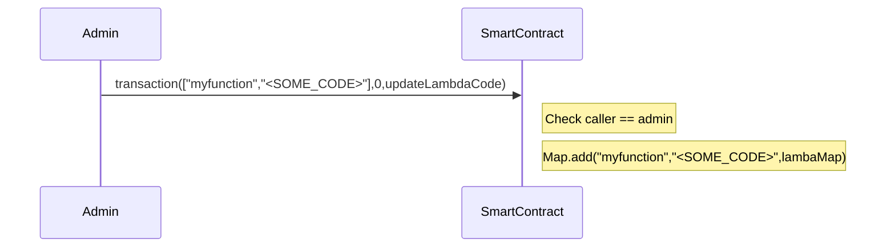
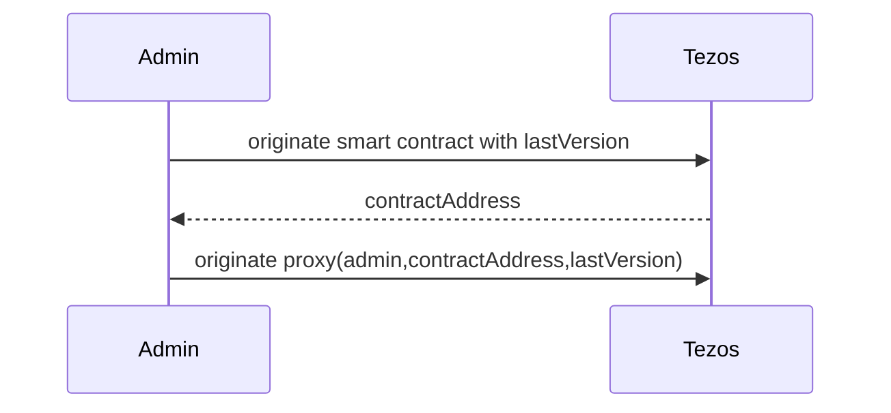
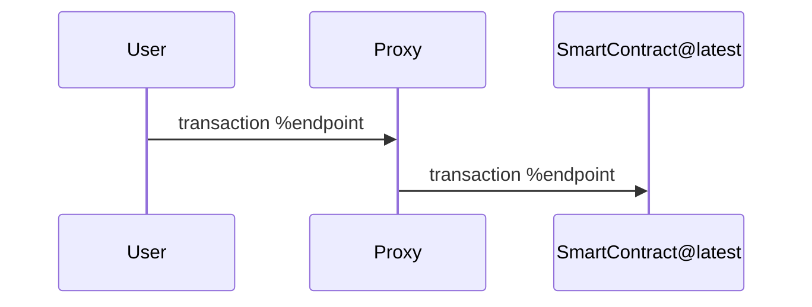
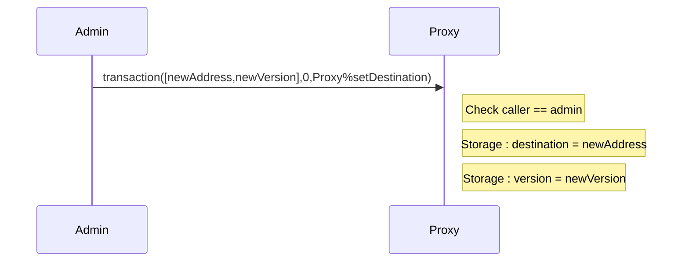

Training dapp n°4
===

# :point_up:  Upgradable Poke game

Previously, you learned how to use tickets and don't mess up with it.
In this third session, you will enhance your skills on :
- upgrading a smart contract with lambda function code
- upgrading a smart contract with proxy

As you maybe know, smart contracts are immutable but in real life, applications are not and evolve. During the past several years, bugs and vulnerabilities in smart contracts caused millions of dollars to get stolen or lost forever. Such cases may even require manual intervention in blockchain operation to recover the funds.

Let's see 2 tricks that allow to upgrade a contract


# :memo: Prerequisites

There is nothing more than you needed on first session : https://github.com/marigold-dev/training-dapp-1#memo-prerequisites

Get your code from the session 3 or the solution [here](https://github.com/marigold-dev/training-dapp-3/tree/main/solution)

# :arrows_clockwise: Upgrades

As everyone knows, one feature of blockchain is to keep immutable code on a block. This allows transparency, traceability and trustlessness.

But application lifecycle implies to evolve and upgrade code to fix bug or bring functionalities. So how can we do it ?

> https://gitlab.com/tezos/tzip/-/blob/master/proposals/tzip-18/tzip-18.md

> Note : All below solutions break in a wait the fact that a smartcontract is immutable. We can preserve in a way **Trust** if the upgrade process has some security and authenticity around it. Like the first time an admin deploys a smartcontract, any user should be able to trust the code reading it with free read access, the same should apply to the upgrade process (notification of new code version, admin identification, whitelisted auditor reports, ...). To resume, if you really want to avoid DEVOPS centralization, you are about to create a DAO with a voting process amongs some selected users/administrators in order to deploy the new version of the smartcontract ... but let's simplify and talk here only about classical centralized admin deployment

## Naive approach

One can deploy a new version of the smart contract and do a redirection to the new address on front end side 

Complete flow



| Pros | Cons |
| --   |   -- |
| Easiest to do | Old contract remains active, so do bugs. Need to really get rid off it |
|  | Need to migrate old storage, can cost a lot of money or even be too big to copy at init time|
|  | Need to sync/update frontend at each backend migration |
|  | Lose reference to previous contract address, can lead to issues with other dependent contracts |


## Stored Lambda function

This time, the code will be on the storage and being executed at runtime

Init



Interaction



Administration



### Pros/Cons

| Pros | Cons |
| --   |   -- |
| No more migration of code and storage. Update the lambda function code that is on existing storage | If we want also storage, we need to store all in bytes PACKING/UNPACKING and we lose all type checking |
| keep same contract address | IDE or tools do not work anymore on lambda code. Michelson does not protect us from some kinds of mistakes anymore |
|  | Unexpected changes can cause other contract callers to fail, we lose interface benefits |
|  | Harder to audit and trace, can lead to really big security nd Trust issues |
|  | Storing everything as bytes is limited to PACK-able types like nat, string, list, set, map |

### Implementation

We are going to change the implementation of the function `pokeAndGetFeedback`. Getting the feedback will be now as a lambda function on storage. So, we will require : 
- a new entrypoint to change the lambda code
- update current entrypoint to call/execute the lambda

Let's start with adding the lambda function definition of the storage

```typescript
export type feedbackFunction = (oracleAddress : address) => string ;

export type storage = {
    pokeTraces : map<address, pokeMessage>,
    feedback : string,
    ticketOwnership : map<address,ticket<string>>,  //ticket of claims
    feedbackFunction : feedbackFunction
};
```

Update the main function, you 1 more field on storage destructuring

```typescript
export const main = ([action, store] : [parameter, storage]) : return_ => {
    //destructure the storage to avoid DUP
    let {pokeTraces  , feedback  , ticketOwnership,feedbackFunction } = store;
    return match (action, {
        Poke: () => poke([pokeTraces  , feedback  , ticketOwnership, feedbackFunction]) ,
        PokeAndGetFeedback: (other : address) => pokeAndGetFeedback([other,pokeTraces  , feedback  , ticketOwnership,feedbackFunction]),
        Init: (initParam : [address, nat]) => init([initParam[0], initParam[1], pokeTraces  , feedback  , ticketOwnership , feedbackFunction])
      } 
    )
};
```

Write the new PokeAndGetFeedback function where we will introduce the lamda call

```typescript
// @no_mutation
const pokeAndGetFeedback = ([oracleAddress,pokeTraces  , feedback  , ticketOwnership, feedbackFunction]:[address,map<address, pokeMessage>  , string  , map<address,ticket<string>>, feedbackFunction]) : return_ => {

    //extract opt ticket from map
    const [t , tom] : [option<ticket<string>>, map<address,ticket<string>>]  = Map.get_and_update(Tezos.get_source(), None() as option<ticket<string>>,ticketOwnership);

    let feedbackMessage = {receiver : oracleAddress ,feedback: feedbackFunction(oracleAddress) };

    return match(t, {
        None : () => failwith("User does not have tickets => not allowed"),
        Some : (_t : ticket<string>) => [  list([]) as list<operation>, { 
                        feedback,
                        pokeTraces : Map.add(Tezos.get_source(),feedbackMessage , pokeTraces),
                        ticketOwnership : tom ,
                        feedbackFunction
                        }]
    });
};
```

Note the line with `feedbackFunction(oracleAddress)`, so we call the lambda and still pass the address parameter

On a first time we will inject the old code to check all still works and then we will modify the lamda code on the storage to check that behavior has changed.

To modify the lambda function code we need an extra admin entrypoint `UpdateFeedbackFunction`

Add this new entrypoint case on the `main` function switch-case pattern matching `match`. It just override the function definition. 

```typescript
        UpdateFeedbackFunction : (newCode : feedbackFunction) => [list([]),{pokeTraces  , feedback  , ticketOwnership, feedbackFunction : newCode}] 
```

Add it also to the parameter definition

```typescript
export type parameter =
| ["Poke"]
| ["PokeAndGetFeedback", address]
| ["Init", address, nat]
| ["UpdateFeedbackFunction",feedbackFunction]
;
```

As we broke the storage definition earlier, fix all storage field missing warnings on `poke` and `init` functions 

```typescript
const poke = ([pokeTraces  , feedback  , ticketOwnership,feedbackFunction] : [map<address, pokeMessage>  , string  , map<address,ticket<string>>,feedbackFunction]) : return_ => {
    
    //extract opt ticket from map
    const [t , tom] : [option<ticket<string>>, map<address,ticket<string>>]  = Map.get_and_update(Tezos.get_source(), None() as option<ticket<string>>,ticketOwnership);
    
    return match(t, {
        None : () => failwith("User does not have tickets => not allowed"),
        Some : (_t : ticket<string>) => [  list([]) as list<operation>,{ //let t burn
        feedback,
        pokeTraces : Map.add(Tezos.get_source(), {receiver : Tezos.get_self_address(), feedback : ""},pokeTraces),
        ticketOwnership : tom,
        feedbackFunction
     }]
    });
};

const init = ([a, ticketCount, pokeTraces  , feedback  , ticketOwnership, feedbackFunction] : [address, nat, map<address, pokeMessage>  , string  , map<address,ticket<string>>,feedbackFunction]) : return_ => {
    if(ticketCount == (0 as nat)){
        return [  list([]) as list<operation>,{
            feedback,
            pokeTraces,
            ticketOwnership ,  
            feedbackFunction
            }];
    } else {
        return [  list([]) as list<operation>,{
            feedback,
            pokeTraces,
            ticketOwnership : Map.add(a,Tezos.create_ticket("can_poke", ticketCount),ticketOwnership) ,  
            feedbackFunction
            }];
    }
};
```

Time to compile and play with the CLI

```bash
ligo compile contract ./smartcontract/pokeGame.jsligo --output-file pokeGame.tz --protocol jakarta
```

Compile an initial storage. Here we inject the old initial value of the lambda function (i.e calling a view to get a feedback) 

```bash
ligo compile storage ./smartcontract/pokeGame.jsligo '{pokeTraces : Map.empty as map<address, pokeMessage> , feedback : "kiss" , ticketOwnership : Map.empty as map<address,ticket<string>>,feedbackFunction : ((oracleAddress : address) : string => { return match( Tezos.call_view("feedback", unit, oracleAddress) as option<string> , { Some : (feedback : string) => feedback,  None : () => failwith("Cannot find view feedback on given oracle address")  }); }) }' --output-file pokeGameStorage.tz  --protocol jakarta
```

Redeploy to testnet, replacing <ACCOUNT_KEY_NAME> with your own user alias ⚠️

```bash
tezos-client originate contract mycontract transferring 0 from <ACCOUNT_KEY_NAME> running pokeGame.tz --init "$(cat pokeGameStorage.tz)" --burn-cap 1 --force
```

```logs
New contract KT1HRu51cEigmqa8jeLZkqXfL1QYHzSFAMdc originated.
```

Time to go on the dapp to test

Replace the contract address on dapp/src/App.tsx file with above value you got

Mint 1 ticket, wait for confirmation and poke a contract address, wait for confirmation and then click on button to refresh the contract list
So far so good, you have the same result as previous training

Now, we update the lambda function in background with the CLI with our new admin entrypoint. With return a fixed string this time, just for demo purpose and verification

```bash
ligo compile parameter ./smartcontract/pokeGame.jsligo 'UpdateFeedbackFunction((oracleAddress : address) : string => "YEAH!!!")' --output-file pokeGameParameter.tz  --protocol jakarta

tezos-client transfer 0 from <ACCOUNT_KEY_NAME> to mycontract --arg "$(cat pokeGameParameter.tz)"
```

Mint 1 ticket, wait for confirmation and poke again , wait for confirmation and then click on button to refresh the contract list

You see that the feedback has changed YEAH!!!  :metal:

> Optional : fix your units tests

## Proxy pattern

Goal is to have a proxy contract that maintain the application lifecycle, it is an enhancement of previous naive solution. We will have to deploy a complete new smartcontract, by this time we are not talking directly to this version. Instead, the proxy remains the default entrypoint and keep same address.

Init



Interaction



Administration



> Note : 2 location choices for the smart contract storage :
> - at proxy level : storage stays unique and immutable
> - at end-contract level : storage is new at each new version and need to be migrated

### Pros/Cons

| Pros | Cons |
| --   |   -- |
| Migration is transparent for frontend | smart contract code `Tezos.SENDER` will always refer to the proxy, so need to be careful |
| if storage is unchanged, we can keep storage at proxy level without cost | If storage changes, need to migrate storage from old contract to new contract and it costs money and having storage at proxy level is not more possible |
| keep same contract address | If contract interface changed, we need to re-originating the proxy |

### Implementation

Rename your file `pokeGame.jsligo` to `pokeGameLambda.jsligo` (to save it somewhere and watch it later if needed ...)

Get back the original version of `pokeGame.jsligo` from previous training (again, it will be easier to start from here)

Create a new file `./smartcontract/tzip18.jsligo`

```bash
touch ./smartcontract/tzip18.jsligo
```

Edit the file

```typescript
// Tzip 18 types
export type tzip18 = {
  proxy : address,
  version : nat,
  contractPrevious : option<address>,
  contractNext : option<address> 
};
```

This type will be included on all smartcontract storages to track the proxy address and the last contract version. It will be used to block old smart contract instances to be called, and check who can call who

Get back to `pokeGame.jsligo` and import this file on first line

```typescript
#import "./tzip18.jsligo" "TZIP18"
```

add the type on the storage definition

```typescript
export type storage = {
    pokeTraces : map<address, pokeMessage>,
    feedback : string,
    ticketOwnership : map<address,ticket<string>>,  //ticket of claims
    tzip18 : TZIP18.tzip18
};
```

Now, we will have to modify `parameter` type to be completely generic

```typescript
type parameter = {
  entrypointName  : string,
  payload : bytes
};
```

The parameter will be a string representing the entrypoint name and some generic bytes that will will need to cast later.
In a way, we break a bit compiler checks, but if we code well and cast stuff as earliest as possible then we mitigate risks

Fix all missing field tzip18 on storage structure in the file

```typescript
const poke = ([pokeTraces  , feedback  , ticketOwnership,tzip18] : [map<address, pokeMessage>  , string  , map<address,ticket<string>>,TZIP18.tzip18]) : return_ => {
    
    //extract opt ticket from map
    const [t , tom] : [option<ticket<string>>, map<address,ticket<string>>]  = Map.get_and_update(Tezos.get_source(), None() as option<ticket<string>>,ticketOwnership);
    
    return match(t, {
        None : () => failwith("User does not have tickets => not allowed"),
        Some : (_t : ticket<string>) => [  list([]) as list<operation>,{ //let t burn
        feedback,
        pokeTraces : Map.add(Tezos.get_source(), {receiver : Tezos.get_self_address(), feedback : ""},pokeTraces),
        ticketOwnership : tom,
        tzip18 
     }]
    });
};

// @no_mutation
const pokeAndGetFeedback = ([oracleAddress,pokeTraces  , feedback  , ticketOwnership,tzip18]:[address,map<address, pokeMessage>  , string  , map<address,ticket<string>>,TZIP18.tzip18]) : return_ => {
  
  //extract opt ticket from map
  const [t , tom] : [option<ticket<string>>, map<address,ticket<string>>]  = Map.get_and_update(Tezos.get_source(), None() as option<ticket<string>>,ticketOwnership);
    
  //Read the feedback view
  let feedbackOpt : option<bytes> = Tezos.call_view("getView", "feedback", oracleAddress);

  return match(t, {
        None : () => failwith("User does not have tickets => not allowed"),
        Some : (_t : ticket<string>) =>

  match( feedbackOpt , {
    Some : (f : bytes) => {
        let feedbackMessage = {receiver : oracleAddress ,feedback: Option.unopt(Bytes.unpack(f) as option<string>)};
        return [  list([]) as list<operation>, { 
          feedback,
          pokeTraces : Map.add(Tezos.get_source(),feedbackMessage , pokeTraces),
          ticketOwnership : tom,
          tzip18
          }]; 
        }, 
    None : () => failwith("Cannot find view feedback on given oracle address")
  })});
};

const init = ([a, ticketCount, pokeTraces  , feedback  , ticketOwnership, tzip18] : [address, nat, map<address, pokeMessage>  , string  , map<address,ticket<string>>,TZIP18.tzip18]) : return_ => {
    if(ticketCount == (0 as nat)){
        return [  list([]) as list<operation>,{
            feedback,
            pokeTraces,
            ticketOwnership,
            tzip18
            }];
    } else {
        return [  list([]) as list<operation>,{
            feedback,
            pokeTraces,
            ticketOwnership : Map.add(a,Tezos.create_ticket("can_poke", ticketCount),ticketOwnership),
            tzip18
            }];
    }
};
```

- The view call singature is different : 
  - it returns an optional bytes 
  - calling "getView" generic view exposed by the proxy
  - passing the viewname "feedback" (to disptach to the correct function once you reach the code that will be executed)
  - finally, unpack the bytes result and cast it to string
  

Rewrite the main function now

```typescript
export const main = ([action, store] : [parameter, storage]) : return_ => {

    //destructure the storage to avoid DUP
    let {pokeTraces  , feedback  , ticketOwnership, tzip18 } = store;

    const canBeCalled : bool = match(tzip18.contractNext , { 
     None : () => false, // I am the last version, but I cannot be called directly (or is my proxy, see later)
     Some : (contract : address) => {if(Tezos.get_sender() == contract){return true;} // I am not the last but a parent contract is calling me
                                     else {return false;}} // I am not the last version and a not-parent is trying to call me
    });

    if(Tezos.get_sender() != tzip18.proxy && !canBeCalled) return failwith("Only the proxy or contractNext can call this contract");
    
    
    if(action.entrypointName == "Poke") { 
            return poke([pokeTraces  , feedback  , ticketOwnership, tzip18]);
        }
        else {
            if(action.entrypointName == "PokeAndGetFeedback") {
                return match((Bytes.unpack(action.payload) as option<address>), {
                    None : () => failwith("Cannot find the address parameter for PokeAndGetFeedback"),
                    Some : (other:address) => pokeAndGetFeedback([other, pokeTraces  , feedback  , ticketOwnership, tzip18])
                });
            }
            else {
                if(action.entrypointName == "Init"){ 
                    return match((Bytes.unpack(action.payload) as option<[address, nat]>), {
                        None : () => failwith("Cannot find the address parameter for changeVersion"),
                        Some : (initParam:[address, nat]) => init([initParam[0], initParam[1], pokeTraces  , feedback  , ticketOwnership, tzip18])
                    });
                }
                else { if(action.entrypointName == "changeVersion") {
                    return match((Bytes.unpack(action.payload) as option<address>), {
                        None : () => failwith("Cannot find the address parameter for changeVersion"),
                        Some : (other:address) => changeVersion([other, pokeTraces  , feedback  , ticketOwnership, tzip18])
                    });
                    }
                    else {
                        return failwith("Non-existant method"); 
                    }
                }
            }
        }
    
};
```

- We start by checking that only the proxy contract or the parent of this contract can call the main function. We enable this feature in case the future contract wants to run a migration *script* itself, reading from children storage (looking at `tzip18.contractPrevious` field ). 
- As we don't have variant anymore, we break the pattern matching and do `if...else` statement
- When a payload is passed, we unpack it and cast it with `(Bytes.unpack(action.payload) as option<MY_TYPE_HERE>)`. It means the caller and callee agree on payload structure for each endpoint

Add the last missing function that change the version of this contract and make it obsolete

```typescript
/**
* Function called by a parent contract or administrator to set the current version on an old contract
**/
const changeVersion = ([newAddress, pokeTraces  , feedback  , ticketOwnership, tzip18]:[address,map<address, pokeMessage>  , string  , map<address,ticket<string>>,TZIP18.tzip18]) : return_ => {
  return [list([]) as list<operation>, {pokeTraces  , feedback  , ticketOwnership, tzip18 : {...tzip18, contractNext : Some(newAddress)}} ];
};
```

Finally, change the view to a generic one and do a switch on the first argument

```typescript
// @view
const getView = ([viewName, store] : [string, storage]) : bytes => { 
  if(viewName == "feedback") {return Bytes.pack(store.feedback);}
  else return failwith("View "+viewName+" not found on this contract");
};
```


Compile

```bash
ligo compile contract ./smartcontract/pokeGame.jsligo --output-file pokeGame.tz --protocol jakarta
```

All good :ok_hand:


Second part, we write the unique proxy 

Create a file `./smartcontract/proxy.jsligo`

Let's define the storage and entrypoints

```typescript
type storage = {
  governance : address, //admins
  entrypoints : big_map<string,entrypointType> //interface schema map
};

type parameter = 
  | ["Call",callContract] 
  | ["Upgrade",list<entrypointOperation>,option<changeVersion>] 
;

type _return = [list<operation>,storage];
```

- storage : 
  - holds a /or several admin
  - the interface schema map for all underlying entrypoints
- parameter :
  - call : forward any request to the right underlying entrypoint
  - upgrade : admin endpoint to update the interface schema map or change smartcontract version

Add our missing types juste above

```typescript
type callContract = { 
  entrypointName : string, 
  payload         : bytes
};

type entrypointType = {
  method  : string,
  addr    : address
};

type entrypointOperation = {
  name        : string,
  isRemoved  : bool,
  entrypoint  : option<entrypointType> 
};

type changeVersion = {
  old : address,
  new : address
};
```

- callContract : payload from user executing an entrypoint (name+payloadBytes)
- entrypointType : payload to be able to call an underlying contract (name+address)
- entrypointOperation : change the entrypoint interface map (new state of the map)
- changeVersion : change the smartcontract version (old/new addresses)

Add the main function (pretty simple) at the end of the file (as always)

```typescript
const main = ([p, s] : [parameter,storage]) : _return => {
return match(p,{
  Call    : (p : parameter) => callContract(p,s),
  Upgrade : (p : parameter) => upgrade(p,s)
  });
};
```

Add the `Call`entrypoint (simple forward). (Before main function)

```typescript
// the proxy function 
const callContract = ([param,storage] : [callContract,storage]) : _return => {
    return match(Big_map.find_opt(param.entrypointName, storage.entrypoints), {
        None : () => failwith("No entrypoint found"),
        Some : (entry : entrypointType) => match(Tezos.get_contract_opt(entry.addr) as option<contract<callContract>>,{
                                            None : () => failwith("No contract found at this address"),
                                            Some : (contract : contract) => [(list([Tezos.transaction({entrypointName : entry.method, payload : param.payload}, Tezos.get_amount(), contract)]) as list<operation> ),storage]
                                        })
        });
};
```

It gets the entrypoint to call and the payload in bytes and just forward it to the right location

Then, write the `upgrade` entrypoint. (Before main function)

```typescript
/**
* Function for administrators to update entrypoints and change current contract version 
**/
const upgrade = ([param ,s] : [[list<entrypointOperation> , option<changeVersion>],storage]) : _return => { 
  
  if(Tezos.get_sender() != s.governance) {return failwith("Permission denied");} 

  let [upgraded_ep_list, changeVersionOpt] = param;

  const update_storage = ([l, m] :  [list<entrypointOperation> , big_map<string, entrypointType>]) : big_map<string, entrypointType> => {
    
    return match(l,list([
      ([] : list<entrypointOperation>) => m,
      ([x,...xs] : list<entrypointOperation>) => {
        let b : big_map<string, entrypointType> = match(x.entrypoint, {
             None : () => {if(x.isRemoved == true){return Big_map.remove(x.name,m);} else {return m;}}, //mean to remove or unchanged
             Some : (_ep : entrypointType) => { //means to add new or unchanged
                if(x.isRemoved == false){ return match(x.entrypoint,{ 
                                             None : () => m,
                                             Some : (c:entrypointType) => Big_map.update(x.name,Some(c),m)
                                            });
                }
                else {return m;}
                }
             });
        return update_storage(xs, b);
        }
    ])
    );
  };      
  
  //update the entrpoint interface map
  const new_entrypoints : big_map<string,entrypointType> = update_storage(upgraded_ep_list, s.entrypoints);

  //check if version needs to be changed
  return match(changeVersionOpt,{
   None : ()      => [(list([]) as list<operation>), {...s, entrypoints : new_entrypoints}],
   Some : (change : changeVersion) => {
                let op_change : operation = match( (Tezos.get_contract_opt(change.old) as option<contract<callContract>>), {
                         None : ()  => failwith("No contract found at this address"),
                         Some : (contract:contract) => {
                                        let amt = Tezos.get_amount();  
                                        let payload : address = change.new;
                                        return Tezos.transaction({entrypointName : "changeVersion", payload : Bytes.pack(payload)}, amt, contract);
                                        }
                        });
                return [(list([op_change]) as list<operation>), {...s, entrypoints : new_entrypoints}];
                }
 });

}; 
```

- It loops over the new interface schema to update and do so.
- If a changeVersion is required, it calls the old contract to take the new version configuration (and desactivate itself so)

Last change is to expose any view from underlying contract (has we have one)

```typescript
// @view
const getView = ([viewName, store] : [string, storage]) : bytes => { 
  return match( Big_map.find_opt(viewName,store.entrypoints) , {
    None : () => failwith("View "+viewName+" not declared on this proxy"),
    Some : (ep : entrypointType) => Option.unopt(Tezos.call_view("getView", viewName, ep.addr) as option<bytes>)
  });
};
```

- we expose a generic view on the proxy and we take the name of the final function we want to call on the underlying contract (as the smart contract view is not unreachable/hidden by the proxy contract)
- we search for an exposed view on the interface schema to retrieve the contract address, then we call the view and return the result as an "exposed" view

Compile

```bash
ligo compile contract ./smartcontract/proxy.jsligo --output-file proxy.tz --protocol jakarta
```

We have all ready for deployment :rocket:

Redeploy to testnet, replacing `<ACCOUNT_KEY_NAME>` with your own user alias + `governance:XXXX` by your own user address ⚠️ . 
First, deploy the proxy : 

```bash
ligo compile storage ./smartcontract/proxy.jsligo '{governance : "tz1VApBuWHuaTfDHtKzU3NBtWFYsxJvvWhYk" as address, entrypoints : Big_map.empty as big_map<string,entrypointType>}' --output-file proxyStorage.tz  --protocol jakarta

tezos-client originate contract proxy transferring 0 from <ACCOUNT_KEY_NAME> running proxy.tz --init "$(cat proxyStorage.tz)" --burn-cap 1 --force
```

```logs
New contract KT1VYjTExoE5EHJkT6mBWWoW7BcsHqnJBdgp originated.
```

Keep this proxy address, as you will need to report it below on `tzip18.proxy` field :warning:

Now you can deploy a smartcontract V1. ( :warning: Change with your **proxy address** on below command line) 

```bash
ligo compile storage ./smartcontract/pokeGame.jsligo '{pokeTraces : Map.empty as map<address, pokeMessage> , feedback : "kiss" , ticketOwnership : Map.empty as map<address,ticket<string>>, tzip18: {proxy: ("KT1VYjTExoE5EHJkT6mBWWoW7BcsHqnJBdgp" as address), version : (1 as nat), contractPrevious : None() as option<address>, contractNext : None() as option<address>}}' --output-file pokeGameStorage.tz  --protocol jakarta

tezos-client originate contract mycontract transferring 0 from <ACCOUNT_KEY_NAME> running pokeGame.tz --init "$(cat pokeGameStorage.tz)" --burn-cap 1 --force
```

```logs
New contract KT1GJZWSJ6YYKGJmP9CByspm98u5u6N1Gqnf originated.
```

Let's tell the proxy that there is a first contract deployed with some interface. (:warning: Change with your smart contract address on the command line )

```bash
ligo compile parameter ./smartcontract/proxy.jsligo 'Upgrade([list([ {name : "Poke", isRemoved  : false,  entrypoint : Some({method : "Poke", addr : "KT1GJZWSJ6YYKGJmP9CByspm98u5u6N1Gqnf" as address })} , {name : "PokeAndGetFeedback", isRemoved  : false,  entrypoint : Some({method : "PokeAndGetFeedback", addr : "KT1GJZWSJ6YYKGJmP9CByspm98u5u6N1Gqnf" as address })} , {name : "Init", isRemoved  : false,  entrypoint : Some({method : "Init", addr : "KT1GJZWSJ6YYKGJmP9CByspm98u5u6N1Gqnf" as address })} , {name : "changeVersion", isRemoved  : false,  entrypoint : Some({method : "changeVersion", addr : "KT1GJZWSJ6YYKGJmP9CByspm98u5u6N1Gqnf" as address })}, {name : "feedback", isRemoved  : false,  entrypoint : Some({method : "feedback", addr : "KT1GJZWSJ6YYKGJmP9CByspm98u5u6N1Gqnf" as address })} ]) as list<entrypointOperation>,None() as option<changeVersion>])' --output-file proxyParameter.tz  --protocol jakarta
 
tezos-client transfer 0 from <ACCOUNT_KEY_NAME> to proxy --arg "$(cat proxyParameter.tz)" --burn-cap 1
```

Lets' go to the frontend

Update a bit some dependencies (i.e old version of taquito cannot fetch tickets on MichelsonMap for example)

```bash
cd dapp
yarn add -D @airgap/beacon-types@^3.1.4
yarn upgrade @airgap/beacon-sdk@^3.1.4 @taquito/beacon-wallet@^14.0.0 @taquito/taquito@^14.0.0
```

Edit ./dapp/App.tsx and change the contract address, display, etc ...

```typescript
import { Contract, ContractsService } from '@dipdup/tzkt-api';
import { PackDataResponse } from "@taquito/rpc";
import { MichelCodecPacker, MichelsonMap, TezosToolkit, WalletContract } from '@taquito/taquito';
import { useState } from 'react';
import './App.css';
import ConnectButton from './ConnectWallet';
import DisconnectButton from './DisconnectWallet';

type entrypointType = {
  method  : string,
  addr    : string
};

type storage = {
  governance : string, //admins
  entrypoints : MichelsonMap<string,entrypointType> //interface schema map
};

type pokeMessage = {
  receiver : string,
  feedback : string
};

type callContract = { 
  entrypointName : string, 
  payload         : string //hexadecimal
};

function App() {
  
  const [Tezos, setTezos] = useState<TezosToolkit>(new TezosToolkit("https://jakartanet.tezos.marigold.dev"));
  const [wallet, setWallet] = useState<any>(null);
  const [userAddress, setUserAddress] = useState<string>("");
  const [userBalance, setUserBalance] = useState<number>(0);

  const [contractToPoke, setContractToPoke] = useState<string>("");
  
  Tezos.setPackerProvider(new MichelCodecPacker());


  //tzkt
  const contractsService = new ContractsService( {baseUrl: "https://api.jakartanet.tzkt.io" , version : "", withCredentials : false});
  const [contracts, setContracts] = useState<Array<Contract>>([]);
  
  const fetchContracts = () => {
    (async () => {
      let contracts = (await contractsService.getSimilar({address:"KT1VYjTExoE5EHJkT6mBWWoW7BcsHqnJBdgp" , includeStorage:true, sort:{desc:"id"}}));
      contracts = await Promise.all(contracts.map(async (c:Contract) => await extractContractStorage(c)));
      console.log("contracts",contracts);
      
      setContracts(contracts);
    })();
  }
  
  //poke
  const poke = async (e :  React.MouseEvent<HTMLButtonElement>, contract : Contract) => {  
    e.preventDefault(); 
    let c : WalletContract = await Tezos.wallet.at(""+contract.address);
    try {
      console.log("contractToPoke",contractToPoke);
      const p = new MichelCodecPacker(); 
      let contractToPokeBytes: PackDataResponse = await p.packData({
        data: { string: contractToPoke },
        type: { prim: "address" }
      });
      console.log("packed",contractToPokeBytes.packed);

      const op = await c.methods.call("PokeAndGetFeedback",contractToPokeBytes.packed).send();
      await op.confirmation();
      alert("Tx done");
    } catch (error : any) {
      console.log(error);
      console.table(`Error: ${JSON.stringify(error, null, 2)}`);
    }
  };

    //mint
    const mint = async (e :  React.MouseEvent<HTMLButtonElement>, contract : Contract) => {  
      e.preventDefault(); 
      let c : WalletContract = await Tezos.wallet.at(""+contract.address);
      try {
        console.log("contractToPoke",contractToPoke);
        
        const p = new MichelCodecPacker(); 
        let initBytes: PackDataResponse = await p.packData({
          data: { prim : "Pair" , args : [{string: userAddress},{int:"1"}]  },
          type: { prim : "Pair" , args : [{prim: "address"},{prim : "nat"}]  }
        });
        const op = await c.methods.call("Init",initBytes.packed).send();

        await op.confirmation();
        alert("Tx done");
      } catch (error : any) {
        console.log(error);
        console.table(`Error: ${JSON.stringify(error, null, 2)}`);
      }
    };
  
    //alter proxy to add underlying storage
  const extractContractStorage = async (proxy : Contract) : Promise<Contract> => {
    //get contract address from first entrypoint
    let taquitocontract = await Tezos.wallet.at(""+proxy.address);
    const taquitoStorage : storage = await taquitocontract.storage() as storage;    
    let firstEp : entrypointType | undefined  = await taquitoStorage.entrypoints.get("Poke"); 
    let underlyingContract : WalletContract = await Tezos.wallet.at(""+firstEp!.addr);
    proxy.storage.underlyingContract = await underlyingContract.storage();
    //console.log("underlyingContract",proxy.storage.underlyingContract);
    return new Promise((resolve,reject)=>resolve(proxy));
  }
  
  return (
    <div className="App">
    <header className="App-header">
    
    <ConnectButton
    Tezos={Tezos}
    setWallet={setWallet}
    setUserAddress={setUserAddress}
    setUserBalance={setUserBalance}
    wallet={wallet}
    />
    
    <DisconnectButton
    wallet={wallet}
    setUserAddress={setUserAddress}
    setUserBalance={setUserBalance}
    setWallet={setWallet}
    />

    
    <div>
    I am {userAddress} with {userBalance} mutez
    </div>
    
    
    <br />
    <div>
    <button onClick={fetchContracts}>Fetch contracts</button>
    <table><thead><tr><th>address</th><th>trace "contract - feedback - user"</th><th>action</th></tr></thead><tbody>
    {contracts.map((contract) => <tr>
      <td style={{borderStyle: "dotted"}}>{contract.address}</td>
      <td style={{borderStyle: "dotted"}}>{(contract.storage !== null && contract.storage.underlyingContract.pokeTraces !== null 
        && contract.storage.underlyingContract.pokeTraces.size > 0)?
        Array.from((contract.storage.underlyingContract.pokeTraces as MichelsonMap<string,pokeMessage>).keys()).map((k : string)=>contract.storage.underlyingContract.pokeTraces.get(k).receiver+" "+contract.storage.underlyingContract.pokeTraces.get(k).feedback+" "+k+",")
        :""}</td>
      <td style={{borderStyle: "dotted"}}><input type="text" onChange={e=>{console.log("e",e.currentTarget.value);setContractToPoke(e.currentTarget.value)}} placeholder='enter contract address here' />
                                          <button onClick={(e) =>poke(e,contract)}>Poke</button>
                                          <button onClick={(e)=>mint(e,contract)}>Mint 1 ticket</button></td>
                              </tr>)}
    </tbody></table>
    </div>
    
    
    </header>
    </div>
    );
  }
  
  export default App;
```

- contract address now is pointing to your **proxy** address
- we have added a function **extractContractStorage**. It is appending the storage of the underlying contract to the proxy storage, so we can display it on the table like before :)
- we have altered the call to exposed entrypoint. Because all is generic now on the proxy, we always do `await c.methods.call("my_entrypoint_name",my_packed_payload_bytes).send()`

Lets' deploy the frontend locally

```bash
yarn run start
```

You can do all the same actions as before through the proxy.
1. Login
1. Refresh the contract list
1. Mint 1 ticket
1. Wait for confirmation popup
1. Poke
1. Wait for confirmation popup
1. Refresh the contract list

:ok_hand:

Let's deploy a new contract V2 and test it again.

> Note : Remember that we cannot change the storage.feedback field on any deployed smartcontract bacause we never exposed a method to update it. 
> Let's change this value for the new contract instance, and call it `hello`

```bash
ligo compile storage ./smartcontract/pokeGame.jsligo '{pokeTraces : Map.empty as map<address, pokeMessage> , feedback : "hello" , ticketOwnership : Map.empty as map<address,ticket<string>>, tzip18: {proxy: ("KT1VYjTExoE5EHJkT6mBWWoW7BcsHqnJBdgp" as address), version : (2 as nat), contractPrevious : Some("KT1GJZWSJ6YYKGJmP9CByspm98u5u6N1Gqnf" as address) as option<address>, contractNext : None() as option<address>}}' --output-file pokeGameStorage2.tz  --protocol jakarta

tezos-client originate contract mycontract2 transferring 0 from <ACCOUNT_KEY_NAME> running pokeGame.tz --init "$(cat pokeGameStorage2.tz)" --burn-cap 1 --force
```

```logs
New contract KT1GfEikKr4MMn9eAAY1BQ2UTbsNxhetbBMT originated.
```

Tell our proxy than we have new entrypoints to the V2 and remove the ones from V1. Change below the smart contract address `KT1GfEikKr4MMn9eAAY1BQ2UTbsNxhetbBMT` with yours

```bash
ligo compile parameter ./smartcontract/proxy.jsligo 'Upgrade([list([ {name : "Poke", isRemoved  : false,  entrypoint : Some({method : "Poke", addr : "KT1GfEikKr4MMn9eAAY1BQ2UTbsNxhetbBMT" as address })} , {name : "PokeAndGetFeedback", isRemoved  : false,  entrypoint : Some({method : "PokeAndGetFeedback", addr : "KT1GfEikKr4MMn9eAAY1BQ2UTbsNxhetbBMT" as address })} , {name : "Init", isRemoved  : false,  entrypoint : Some({method : "Init", addr : "KT1GfEikKr4MMn9eAAY1BQ2UTbsNxhetbBMT" as address })} , {name : "changeVersion", isRemoved  : false,  entrypoint : Some({method : "changeVersion", addr : "KT1GfEikKr4MMn9eAAY1BQ2UTbsNxhetbBMT" as address })}, {name : "feedback", isRemoved  : false,  entrypoint : Some({method : "feedback", addr : "KT1GfEikKr4MMn9eAAY1BQ2UTbsNxhetbBMT" as address })} ]) as list<entrypointOperation>,None() as option<changeVersion>])' --output-file proxyParameter2.tz  --protocol jakarta
 
tezos-client transfer 0 from <ACCOUNT_KEY_NAME> to proxy --arg "$(cat proxyParameter2.tz)" --burn-cap 1
```

Test the flow again
1. Refresh the contract list
1. Mint 1 ticket
1. Wait for confirmation popup
1. Poke
1. Wait for confirmation popup
1. Refresh the contract list

Now, your proxy is calling the contract V2 and should return `hello`on the traces and no more `kiss`

Last part is to set the old smart contract as obsolete

> Note : we could have do it in one row in a single transaction as all operations are done in sequence on the operation array

```bash
ligo compile parameter ./smartcontract/proxy.jsligo 'Upgrade([list([]) as list<entrypointOperation>,Some({old : ("KT1GJZWSJ6YYKGJmP9CByspm98u5u6N1Gqnf" as address), new : ("KT1GfEikKr4MMn9eAAY1BQ2UTbsNxhetbBMT" as address) }) as option<changeVersion>])' --output-file proxyParameter3.tz  --protocol jakarta
 
tezos-client transfer 0 from <ACCOUNT_KEY_NAME> to proxy --arg "$(cat proxyParameter3.tz)" --burn-cap 1
```

Check on an indexer that storage.tzip18.contractNext is pointing to the next version address : [https://jakartanet.tzkt.io/KT1GJZWSJ6YYKGJmP9CByspm98u5u6N1Gqnf/storage/](https://jakartanet.tzkt.io/KT1GJZWSJ6YYKGJmP9CByspm98u5u6N1Gqnf/storage/)

:tada: This ends the proxy pattern implementation. Your old contract is no more "runnable" and your proxy is pointing to the last version

## Alternative : Composability

Managing a monolithic smartcontract like a microservice can reduce the problem, on the other side it increase complexity and application lifecycle on OPS side

# :palm_tree: Conclusion :sun_with_face:

Now, you are able to upgrade deployed contracts
