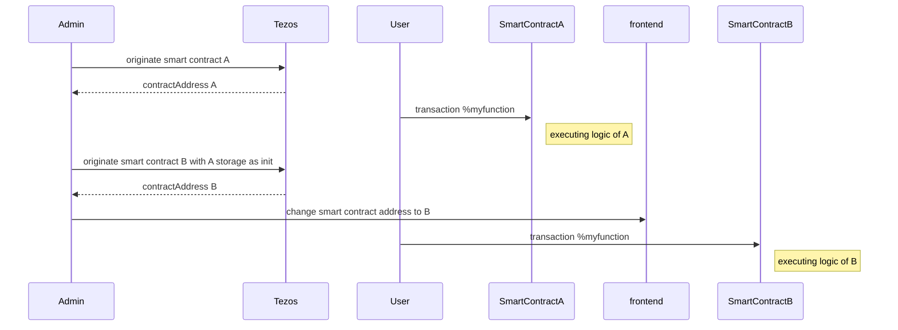
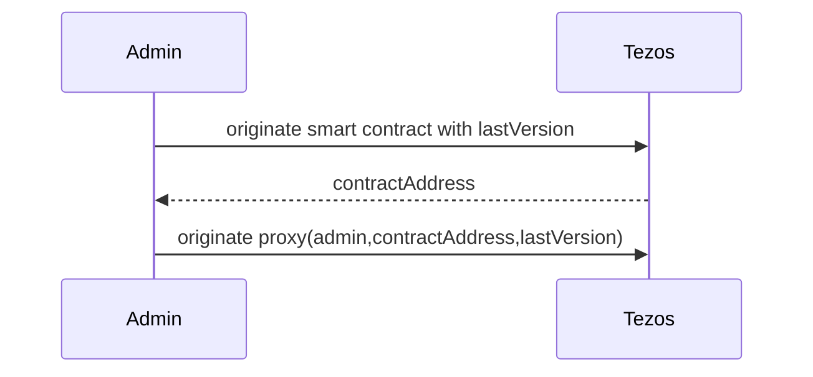
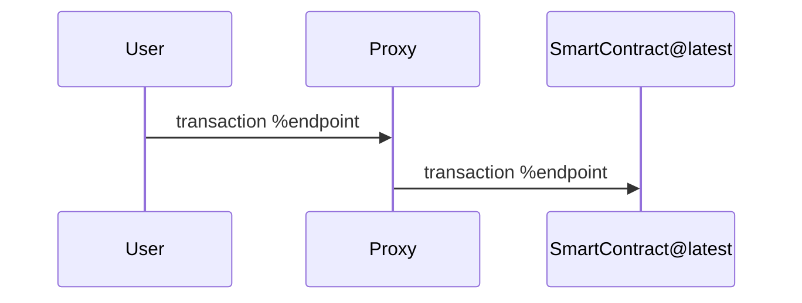
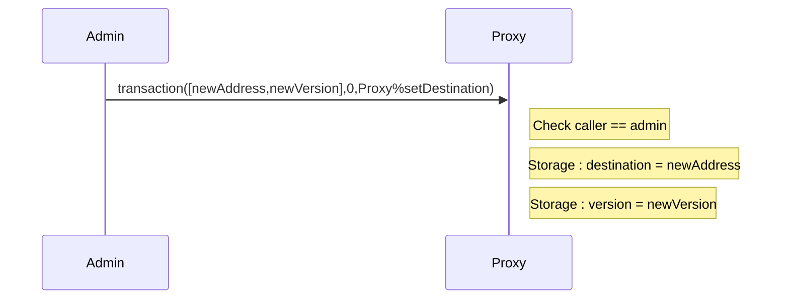
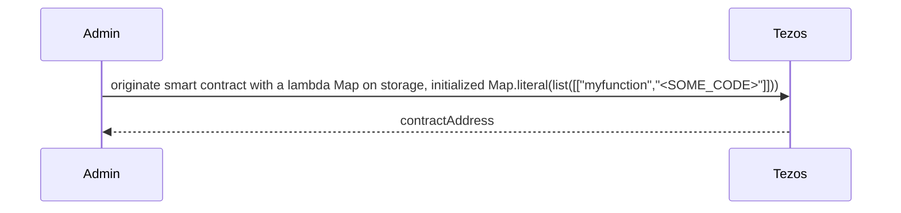
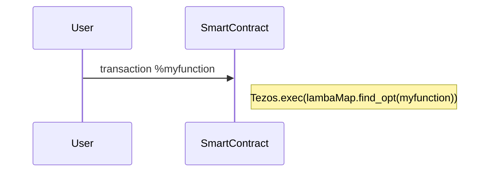
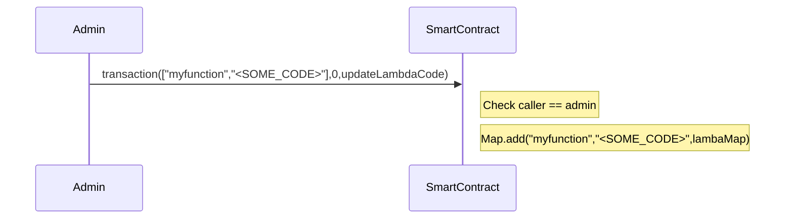

Training dapp n°4
===

# :point_up:  Upgradable Poke game

Previously, you learned how to use tickets and don't mess up with it.
In this third session, you will enhance your skills on :
- upgrading a smart contract with proxy
- upgrading a smart contract with lambda function code

As you maybe know, smart contracts are immutable but in real life, applications are not and evolve. During the past several years, bugs and vulnerabilities in smart contracts caused millions of dollars to get stolen or lost forever. Such cases may even require manual intervention in blockchain operation to recover the funds.

Let's see 2 tricks that allow to upgrade a contract

# :memo: Prerequisites

There is nothing more than you needed on first session : https://github.com/marigold-dev/training-dapp-1#memo-prerequisites

Get your code from the session 3 or the solution [here](https://github.com/marigold-dev/training-dapp-3/tree/main/solution)

# :arrows_clockwise: Upgrades

As everyone knows, one feature of blockchain is to keep immutable code on a block. This allows transparency, traceability and trustlessness.

But application lifecycle implies to evolve and upgrade code to fix bug or bring functionalities. So how can we do it ?

> https://gitlab.com/tezos/tzip/-/blob/master/proposals/tzip-18/tzip-18.md

## Naive approach

One can deploy a new version of the smart contract and do a redirection to the new address on front end side 

Complete flow

| Pros | Cons |
| --   |   -- |
| Easiest to do | Old contract remains active, so do bugs. Need to really get rid off it |
|  | Need to migrate old storage, can cost a lot of money |
|  | Need to sync/update frontend at each backend migration |

## Proxy pattern

Goal is to have a proxy contract that maintain the application lifecycle, it is an enhancement of previous naive solution

Init

Interaction

Administration

> Note : 2 location choices for the storage :
> - at proxy level : storage stays unique and immutable
> - at end-contract level : storage is new at each new version and need to be migrated

### Pros/Cons

| Pros | Cons |
| --   |   -- |
| Migration is transparent for frontend | smart contract code `Tezos.SENDER` will always refer to the proxy, so need to be careful |
| if storage is unchanged, we can keep storage at proxy level without cost | If storage changes, need to migrate storage from old contract to new contract and it costs money and having storage at proxy lvele is not more possible |
|  | If contract interface changed, we need to re-originating the proxy |

### Implementation

> Full example can be found here : https://github.com/smart-chain-fr/tzip18/blob/main/contract/proxy.mligo

## Stored Lambda function

This time, the code will be on the storage and being executed at runtime

Init

Interaction

Administration

### Pros/Cons

| Pros | Cons |
| --   |   -- |
| No more migration of code and storage. Update the lambda function code that is on existing storage | IDE or tools do not work anymore on lambda code. Michelson does not protect us from some kinds of mistakes anymore |
|  | Unexpected changes can cause other contract callers to fail, we lose interface benefits |
|  | Harder to audit and trace |
|  | Storing everything as bytes is limited to PACK-able types like nat, string, list, set, map |

//TODO TZIP-18 proposition like Hyperledger one. Call contract "ALIAS" with "VERSION" from "ADMIN address", protocol knows where is the address of the code version to call, like protocol is having an indexer of similar contract from same Admin and is able to execute the good SOURCE CODE.
When migration is asked : tezos-client migrate contract MY_CONTRACT to version VERSION_X.Y.Z etc ...
OR
use the global table .. ? registred there the last HASH version of deplyed contracts ? ... ? Who can update this table ???

### Implementation

>

## Alternative : Composability

Managing a monolithic smartcontract like a microservice can reduce the problem, on the other side it increase complexity and application lifecycle on OPS side

# :palm_tree: Conclusion :sun_with_face:

Now, you are able to upgrade deployed contracts
