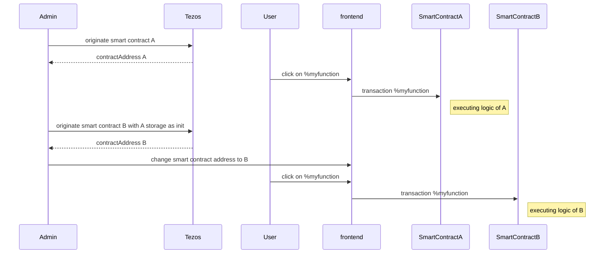
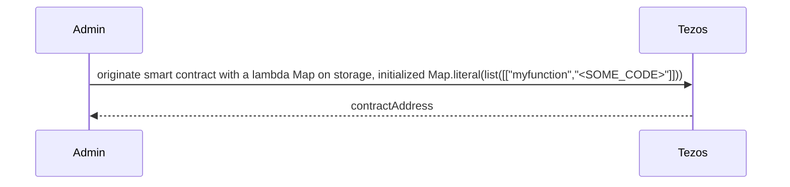
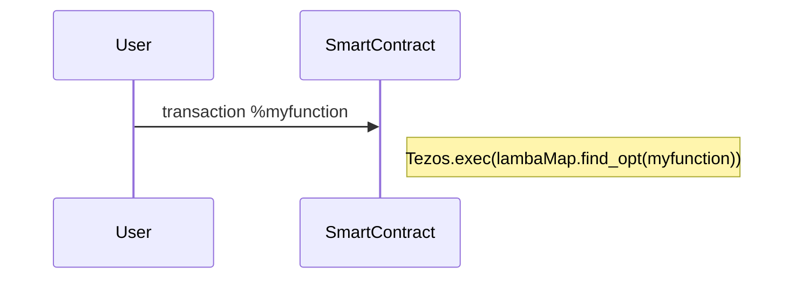
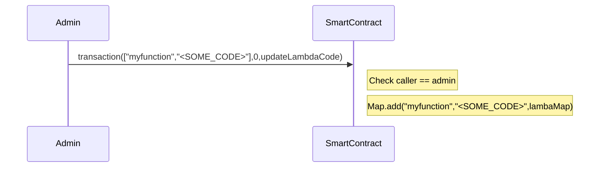
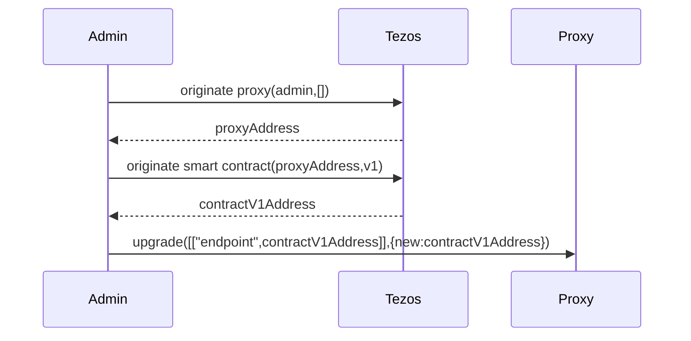
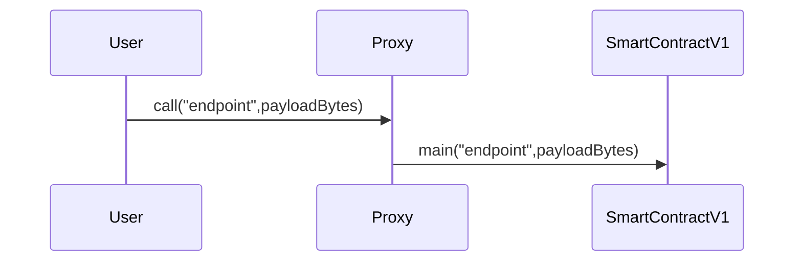
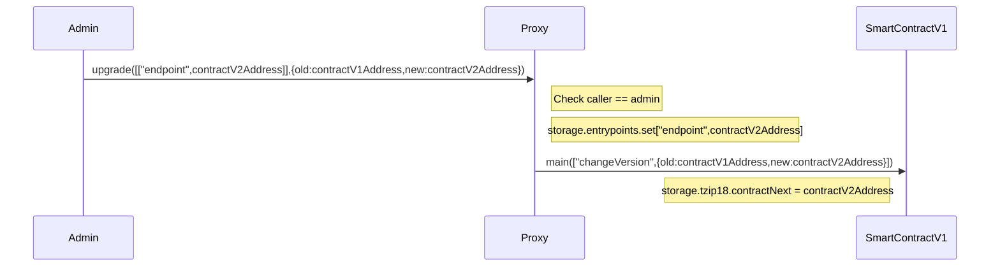

## :round_pushpin: [See Github version and full code here](https://github.com/marigold-dev/training-dapp-4)
# Training dapp n°4

# :point_up: Upgradable Poke game

Previously, you learned how to use tickets and don't mess up with it.
In this third session, you will enhance your skills on :

- upgrading a smart contract with lambda function code
- upgrading a smart contract with proxy

As you maybe know, smart contracts are immutable but in real life, applications are not and evolve. During the past several years, bugs and vulnerabilities in smart contracts caused millions of dollars to get stolen or lost forever. Such cases may even require manual intervention in blockchain operation to recover the funds.

Let's see 2 tricks that allow to upgrade a contract

# :memo: Prerequisites

There is nothing more than you needed on first session : https://github.com/marigold-dev/training-dapp-1#memo-prerequisites

Get your code from the session 3 or the solution [here](https://github.com/marigold-dev/training-dapp-3/tree/main/solution)

# :arrows_clockwise: Upgrades

As everyone knows, one feature of blockchain is to keep immutable code on a block. This allows transparency, traceability and trustlessness.

But application lifecycle implies to evolve and upgrade code to fix bug or bring functionalities. So how can we do it ?

> https://gitlab.com/tezos/tzip/-/blob/master/proposals/tzip-18/tzip-18.md

> Note : All below solutions break in a wait the fact that a smartcontract is immutable. We can preserve in a way **Trust** if the upgrade process has some security and authenticity around it. Like the first time an admin deploys a smartcontract, any user should be able to trust the code reading it with free read access, the same should apply to the upgrade process (notification of new code version, admin identification, whitelisted auditor reports, ...). To resume, if you really want to avoid DEVOPS centralization, you are about to create a DAO with a voting process amongs some selected users/administrators in order to deploy the new version of the smartcontract ... but let's simplify and talk here only about classical centralized admin deployment

## :dizzy_face: Naive approach

One can deploy a new version of the smart contract and do a redirection to the new address on front end side

Complete flow



| Pros          | Cons                                                                                           |
| ------------- | ---------------------------------------------------------------------------------------------- |
| Easiest to do | Old contract remains active, so do bugs. Need to really get rid off it                         |
|               | Need to migrate old storage, can cost a lot of money or even be too big to copy at init time   |
|               | Need to sync/update frontend at each backend migration                                         |
|               | Lose reference to previous contract address, can lead to issues with other dependent contracts |

## Stored Lambda function :star:

This time, the code will be on the storage and being executed at runtime

Init



Interaction



Administration



### Pros/Cons

| Pros                                                                                               | Cons                                                                                                               |
| -------------------------------------------------------------------------------------------------- | ------------------------------------------------------------------------------------------------------------------ |
| No more migration of code and storage. Update the lambda function code that is on existing storage | If we want also storage, we need to store all in bytes PACKING/UNPACKING and we lose all type checking             |
| keep same contract address                                                                         | IDE or tools do not work anymore on lambda code. Michelson does not protect us from some kinds of mistakes anymore |
|                                                                                                    | Unexpected changes can cause other contract callers to fail, we lose interface benefits                            |
|                                                                                                    | Harder to audit and trace, can lead to really big security nd Trust issues                                         |
|                                                                                                    | Storing everything as bytes is limited to PACK-able types like nat, string, list, set, map                         |

### Implementation

We are going to change the implementation of the function `pokeAndGetFeedback`. Getting the feedback will be now as a lambda function on storage. So, we will require :

- a new entrypoint to change the lambda code
- update current entrypoint to call/execute the lambda

Let's start with adding the lambda function definition of the storage

```ligolang
export type feedbackFunction = (oracleAddress: address) => string;

export type storage = {
  pokeTraces: map<address, pokeMessage>,
  feedback: string,
  ticketOwnership: map<address, ticket<string>>, //ticket of claims
  feedbackFunction: feedbackFunction
};
```

Let's do minor changes as you have 1 additional field `feedbackFunction` on storage destructuring.

Edit the `PokeAndGetFeedback` function where we execute the lambda `feedbackFunction(..)`

```ligolang
/* @no_mutation */
/* @entry */
const pokeAndGetFeedback = (oracleAddress: address, store: storage): return_ => {
  const { pokeTraces, feedback, ticketOwnership, feedbackFunction } = store;
  const [t, tom]: [option<ticket<string>>, map<address, ticket<string>>] =
    Map.get_and_update(
      Tezos.get_source(),
      None() as option<ticket<string>>,
      ticketOwnership
    );
  let feedbackMessage = {
    receiver: oracleAddress,
    feedback: feedbackFunction(oracleAddress),
  };

  return match(t, {
    None: () => failwith("User does not have tickets => not allowed"),
    Some: (_t: ticket<string>) => [
      list([]) as list<operation>,
      {
        feedback,
        pokeTraces: Map.add(Tezos.get_source(), feedbackMessage, pokeTraces),
        ticketOwnership: tom,
        feedbackFunction,
      }
    ],
  });
};
```

Note the line with `feedbackFunction(oracleAddress)`, so we call the lambda and still pass the address parameter

On a first time we will inject the old code to check all still works and then we will modify the lamda code on the storage to check that behavior has changed.

To modify the lambda function code we need an extra admin entrypoint `updateFeedbackFunction`

```ligolang
/* @entry */
const updateFeedbackFunction = (newCode: feedbackFunction, store: storage): return_ => {
  const { pokeTraces, feedback, ticketOwnership, feedbackFunction } = store;
  return [
  list([]),
  { pokeTraces, feedback, ticketOwnership, feedbackFunction: newCode }
];
}
```

As we broke the storage definition earlier, fix all storage field missing warnings on `poke` and `init` functions

```ligolang
/* @entry */
const poke = (_: parameter, store: storage): return_ => {
  const { pokeTraces, feedback, ticketOwnership, feedbackFunction } = store;
  const [t, tom]: [option<ticket<string>>, map<address, ticket<string>>] =
    Map.get_and_update(
      Tezos.get_source(),
      None() as option<ticket<string>>,
      ticketOwnership
    );
  return match(
    t,
    {
      None: () => failwith("User does not have tickets => not allowed"),
      Some: (_t: ticket<string>) =>
        [
          list([]) as list<operation>,
          {
            feedback,
            pokeTraces: Map.add(
              Tezos.get_source(),
              { receiver: Tezos.get_self_address(), feedback: "" },
              pokeTraces
            ),
            ticketOwnership: tom,
            feedbackFunction,
          }
        ]
    }
  )
};

/* @entry */
const init = ([a, ticketCount]: [address, nat], store: storage): return_ => {
  const { pokeTraces, feedback, ticketOwnership, feedbackFunction } = store;
  if (ticketCount == (0 as nat)) {
    return [
      list([]) as list<operation>,
      { pokeTraces, feedback, ticketOwnership, feedbackFunction }
    ]
  } else {
    const t: ticket<string> =
      Option.unopt(Tezos.create_ticket("can_poke", ticketCount));
    return [
      list([]) as list<operation>,
      { pokeTraces, feedback, ticketOwnership: Map.add(a, t, ticketOwnership) ,feedbackFunction}
    ]
  }
};
```

Change also the initial storage with the old initial value of the lambda function (i.e calling a view to get a feedback)

```ligolang
#include "pokeGame.jsligo"
const default_storage = {
    pokeTraces : Map.empty as map<address, pokeMessage>,
    feedback : "kiss",
    ticketOwnership : Map.empty as map<address,ticket<string>>,  //ticket of claims
    feedbackFunction : ((oracleAddress : address) : string => { return match( Tezos.call_view("feedback", unit, oracleAddress) as option<string> , { Some : (feedback : string) => feedback,  None : () => failwith("Cannot find view feedback on given oracle address")  }); })
};
```

Time to compile and play with the CLI

> Note : check that Docker is running

```bash
npm i
TAQ_LIGO_IMAGE=ligolang/ligo:0.65.0 taq compile pokeGame.jsligo
```

Redeploy to testnet

```bash
taq deploy pokeGame.tz -e testing
```

```logs
┌─────────────┬──────────────────────────────────────┬──────────┬──────────────────┬────────────────────────────────┐
│ Contract    │ Address                              │ Alias    │ Balance In Mutez │ Destination                    │
├─────────────┼──────────────────────────────────────┼──────────┼──────────────────┼────────────────────────────────┤
│ pokeGame.tz │ KT1EsaXY2FhFu4TSUWX5PNLHc3Eq4FzEVHQG │ pokeGame │ 0                │ https://ghostnet.ecadinfra.com │
└─────────────┴──────────────────────────────────────┴──────────┴──────────────────┴────────────────────────────────┘
```

Time to go on the dapp to test

Regenerate types and run the frontend

```bash
taq generate types ./app/src
cd app
yarn run start
```

Run the user sequence on the web page :

1. Mint 1 ticket
1. wait for confirmation
1. poke a contract address
1. wait for confirmation
1. click on button to refresh the contract list
   So far so good, you have the same result as previous training :ok_hand:

Now, we update the lambda function in background with the CLI with our new admin entrypoint. We return a fixed string this time, just for demo purpose and verify that the lambda executed is returning another output

Edit the file `pokeGame.parameterList.jsligo`

```ligolang
#include "pokeGame.jsligo"
const default_parameter = UpdateFeedbackFunction((_oracleAddress : address) : string => "YEAH!!!");
```

Compile all and call an init transaction

```bash
TAQ_LIGO_IMAGE=ligolang/ligo:0.65.0 taq compile pokeGame.jsligo
taq call pokeGame --param pokeGame.parameter.default_parameter.tz -e testing
```

```logs
┌────────────────┬──────────────────────────────────────┬──────────────────────────────────────────────────┬────────────┬────────────────┬─────────────────────────────────────┐
│ Contract Alias │ Contract Address                     │ Parameter                                        │ Entrypoint │ Mutez Transfer │ Destination                         │
├────────────────┼──────────────────────────────────────┼──────────────────────────────────────────────────┼────────────┼────────────────┼─────────────────────────────────────┤
│ pokeGame       │ KT1FwYoUNAZVhf8Bct4qcAzs78A9SjBspfYy │ (Right (Right { DROP ; PUSH string "YEAH!!!" })) │ default    │ 0              │ https://ghostnet.tezos.marigold.dev │
│                │                                      │                                                  │            │                │                                     │
└────────────────┴──────────────────────────────────────┴──────────────────────────────────────────────────┴────────────┴────────────────┴─────────────────────────────────────┘
```

Run the user sequence on the web page :

1. Mint 1 ticket
1. wait for confirmation
1. poke a contract address
1. wait for confirmation
1. click on button to refresh the contract list

You see that the feedback has changed `YEAH!!!` :metal:

> Optional : fix your units tests

## Proxy pattern :star::star:

Goal is to have a proxy contract maintaining the application lifecycle, it is an enhancement of previous naive solution. We will have to deploy a complete new smartcontract, but this time we are not talking directly to this contract. Instead, the proxy remains the default entrypoint and keep same address.

Init



Interaction



Administration



> Note : 2 location choices for the smart contract storage :
>
> - at proxy level : storage stays unique and immutable
> - at end-contract level : storage is new at each new version and need to be migrated

### Pros/Cons

| Pros                                                                     | Cons                                                                                                                                                    |
| ------------------------------------------------------------------------ | ------------------------------------------------------------------------------------------------------------------------------------------------------- |
| Migration is transparent for frontend                                    | smart contract code `Tezos.SENDER` will always refer to the proxy, so need to be careful                                                                |
| if storage is unchanged, we can keep storage at proxy level without cost | If storage changes, need to migrate storage from old contract to new contract and it costs money and having storage at proxy level is not more possible |
| keep same contract address                                               | If contract interface changed, we need to re-originating the proxy                                                                                      |
|                                                                          | we need a lot of types in bytes playing with PACKING/UNPACKING and we lose all type checking                                                            |
|                                                                          | IDE or tools do not work anymore on lambda code. Michelson does not protect us from some kinds of mistakes anymore                                      |
|                                                                          | Unexpected changes can cause other contract callers to fail, we lose interface benefits                                                                 |
|                                                                          | Harder to audit and trace, can lead to really big security nd Trust issues                                                                              |
|                                                                          | Storing everything as bytes is limited to PACK-able types like nat, string, list, set, map                                                              |

### Implementation

#### Rewrite your smart contract to make it generic

- Rename your file `pokeGame.jsligo` to `pokeGameLambda.jsligo` (to save it somewhere and watch it later if needed ...)
- Remove pokeGame.parameters.jsligo

Get back the original version of `pokeGame.jsligo` from previous training (again, it will be easier to start from here)

Create a new file `tzip18.jsligo`

```bash
taq create contract tzip18.jsligo
```

Edit the file

```ligolang
// Tzip 18 types
export type tzip18 = {
  proxy: address,
  version: nat,
  contractPrevious: option<address>,
  contractNext: option<address>
};
```

This type will be included on all smartcontract storages to track the proxy address and the last contract version. It will be used to block old smart contract instances to be called, and check who can call who

Get back to `pokeGame.jsligo` and import this file on first line

```ligolang
#import "./tzip18.jsligo" "TZIP18"
```

add the type on the storage definition

```ligolang
export type storage = {
  pokeTraces: map<address, pokeMessage>,
  feedback: string,
  ticketOwnership: map<address, ticket<string>>, //ticket of claims
  tzip18: TZIP18.tzip18
};
```

Now, we will have to modify `parameter` type to be completely generic

```ligolang
type parameter = {
  entrypointName: string,
  payload: bytes
};
```

The parameter will be a string representing the entrypoint name and some generic bytes that will will need to cast later.
In a way, we break a bit compiler checks, but if we code well and cast stuff as earliest as possible then we mitigate risks

Fix all missing field tzip18 on storage structure in the file

```ligolang
const poke = ([pokeTraces, feedback, ticketOwnership, tzip18]: [
  map<address, pokeMessage>,
  string,
  map<address, ticket<string>>,
  TZIP18.tzip18
]): return_ => {
  //extract opt ticket from map
  const [t, tom]: [option<ticket<string>>, map<address, ticket<string>>] =
    Map.get_and_update(
      Tezos.get_source(),
      None() as option<ticket<string>>,
      ticketOwnership
    );

  return match(t, {
    None: () => failwith("User does not have tickets => not allowed"),
    Some: (_t: ticket<string>) => [
      list([]) as list<operation>,
      {
        //let t burn
        feedback,
        pokeTraces: Map.add(
          Tezos.get_source(),
          { receiver: Tezos.get_self_address(), feedback: "" },
          pokeTraces
        ),
        ticketOwnership: tom,
        tzip18,
      }
    ]
  });
};

// @no_mutation
const pokeAndGetFeedback = ([
  oracleAddress,
  pokeTraces,
  feedback,
  ticketOwnership,
  tzip18
]: [
  address,
  map<address, pokeMessage>,
  string,
  map<address, ticket<string>>,
  TZIP18.tzip18
]): return_ => {
  //extract opt ticket from map
  const [t, tom]: [option<ticket<string>>, map<address, ticket<string>>] =
    Map.get_and_update(
      Tezos.get_source(),
      None() as option<ticket<string>>,
      ticketOwnership
    );

  //Read the feedback view
  let feedbackOpt: option<bytes> = Tezos.call_view(
    "getView",
    "feedback",
    oracleAddress
  );

  return match(t, {
    None: () => failwith("User does not have tickets => not allowed"),
    Some: (_t: ticket<string>) =>
      match(feedbackOpt, {
        Some: (f: bytes) => {
          let feedbackMessage = {
            receiver: oracleAddress,
            feedback: Option.unopt(Bytes.unpack(f) as option<string>),
          };
          return [
            list([]) as list<operation>,
            {
              feedback,
              pokeTraces: Map.add(
                Tezos.get_source(),
                feedbackMessage,
                pokeTraces
              ),
              ticketOwnership: tom,
              tzip18,
            }
          ]
        },
        None: () =>
          failwith("Cannot find view feedback on given oracle address"),
      }),
  });
};

const init = ([a, ticketCount, pokeTraces, feedback, ticketOwnership, tzip18]: [
  address,
  nat,
  map<address, pokeMessage>,
  string,
  map<address, ticket<string>>,
  TZIP18.tzip18
]): return_ => {
  return ticketCount == (0 as nat)
    ? [
        list([]) as list<operation>,
        {
          feedback,
          pokeTraces,
          ticketOwnership,
          tzip18
        }
      ]
    : [
        list([]) as list<operation>,
        {
          feedback,
          pokeTraces,
          ticketOwnership: Map.add(
            a,
            Tezos.create_ticket("can_poke", ticketCount),
            ticketOwnership
          ),
          tzip18,
        }
      ]
};
```

- The view call signature is different :
  - it returns an optional bytes
  - calling "getView" generic view exposed by the proxy
  - passing the viewname "feedback" (to disptach to the correct function once you reach the code that will be executed)
  - finally, unpack the bytes result and cast it to string

Rewrite the main function now

```ligolang
export const main = ([action, store]: [parameter, storage]): return_ => {
  //destructure the storage to avoid DUP
  let { pokeTraces, feedback, ticketOwnership, tzip18 } = store;

  const canBeCalled: bool = match(tzip18.contractNext, {
    None: () => false, // I am the last version, but I cannot be called directly (or is my proxy, see later)
    Some: (contract: address) => {
      if (Tezos.get_sender() == contract) {
        return true;
      } // I am not the last but a parent contract is calling me
      else {
        return false;
      }
    }, // I am not the last version and a not-parent is trying to call me
  });

  if (Tezos.get_sender() != tzip18.proxy && !canBeCalled){
    return failwith("Only the proxy or contractNext can call this contract");};

  if (action.entrypointName == "Poke") {
    return poke([pokeTraces, feedback, ticketOwnership, tzip18]);
  } else {
    if (action.entrypointName == "PokeAndGetFeedback") {
      return match(Bytes.unpack(action.payload) as option<address>, {
        None: () =>
          failwith("Cannot find the address parameter for PokeAndGetFeedback"),
        Some: (other: address) =>
          pokeAndGetFeedback([
            other,
            pokeTraces,
            feedback,
            ticketOwnership,
            tzip18
          ]),
      });
    } else {
      if (action.entrypointName == "Init") {
        return match(Bytes.unpack(action.payload) as option<[address, nat]>, {
          None: () =>
            failwith("Cannot find the address parameter for changeVersion"),
          Some: (initParam: [address, nat]) =>
            init([
              initParam[0],
              initParam[1],
              pokeTraces,
              feedback,
              ticketOwnership,
              tzip18
            ]),
        });
      } else {
        if (action.entrypointName == "changeVersion") {
          return match(Bytes.unpack(action.payload) as option<address>, {
            None: () =>
              failwith("Cannot find the address parameter for changeVersion"),
            Some: (other: address) =>
              changeVersion([
                other,
                pokeTraces,
                feedback,
                ticketOwnership,
                tzip18
              ]),
          });
        } else {
          return failwith("Non-existant method");
        }
      }
    }
  }
};
```

- We start by checking that only the proxy contract or the parent of this contract can call the main function. We enable this feature in case the future contract wants to run a migration _script_ itself, reading from children storage (looking at `tzip18.contractPrevious` field ).
- As we don't have variant anymore, we break the pattern matching and do `if...else` statement
- When a payload is passed, we unpack it and cast it with `(Bytes.unpack(action.payload) as option<MY_TYPE_HERE>)`. It means the caller and callee agree on payload structure for each endpoint

Add the last missing function changing the version of this contract and make it obsolete (just before the main function)

```ligolang
/**
 * Function called by a parent contract or administrator to set the current version on an old contract
 **/
const changeVersion = ([
  newAddress,
  pokeTraces,
  feedback,
  ticketOwnership,
  tzip18
]: [
  address,
  map<address, pokeMessage>,
  string,
  map<address, ticket<string>>,
  TZIP18.tzip18
]): return_ => {
  return [
    list([]) as list<operation>,
    {
      pokeTraces,
      feedback,
      ticketOwnership,
      tzip18: { ...tzip18, contractNext: Some(newAddress) },
    }
  ]
};
```

Finally, change the view to a generic one and do a `if...else` on `viewName` argument

```ligolang
// @view
const getView = ([viewName, store]: [string, storage]): bytes => {
  if (viewName == "feedback") {
    return Bytes.pack(store.feedback);
  } else return failwith("View " + viewName + " not found on this contract");
};
```

Change the initial storage

> Note : for the moment we set the proxy address to fake KT1 address because we have not yet deploy the proxy

```ligolang
#include "pokeGame.jsligo"
const default_storage = {
    pokeTraces : Map.empty as map<address, pokeMessage>,
    feedback : "kiss",
    ticketOwnership : Map.empty as map<address,ticket<string>>,  //ticket of claims
    tzip18 : {
                proxy : "KT1NNmpuVCZYNQ9eFFNSRecuzxtvb8Zqx1Fk" as address,
                version : 1 as nat,
                contractPrevious : None() as option<address>,
                contractNext : None() as option<address>
             }
};
```

Compile

```bash
taq compile pokeGame.jsligo
```

All good :ok_hand:

#### Second part, we write the unique proxy

Create a file `proxy.jsligo`

```bash
taq create contract proxy.jsligo
```

Let's define the storage and entrypoints on it

```ligolang
type storage = {
  governance: address, //admins
  entrypoints: big_map<string, entrypointType> //interface schema map
};

type parameter =
  | ["Call", callContract]
  | ["Upgrade", list<entrypointOperation>, option<changeVersion>];

type _return = [list<operation>, storage];
```

- storage :
  - holds a /or several admin
  - the interface schema map for all underlying entrypoints
- parameter :
  - call : forward any request to the right underlying entrypoint
  - upgrade : admin endpoint to update the interface schema map or change smartcontract version

Add our missing types juste above

```ligolang
type callContract = {
  entrypointName: string,
  payload: bytes
};

type entrypointType = {
  method: string,
  addr: address
};

type entrypointOperation = {
  name: string,
  isRemoved: bool,
  entrypoint: option<entrypointType>
};

type changeVersion = {
  oldAddr: address,
  newAddr: address
};
```

- callContract : payload from user executing an entrypoint (name+payloadBytes)
- entrypointType : payload to be able to call an underlying contract (name+address)
- entrypointOperation : change the entrypoint interface map (new state of the map)
- changeVersion : change the smartcontract version (old/new addresses)

Add the main function (pretty simple) at the end of the file (as always)

```ligolang
const main = ([p, s]: [parameter, storage]): _return => {
  return match(p, {
    Call: (p: parameter) => callContract(p, s),
    Upgrade: (p: parameter) => upgrade(p, s),
  });
};
```

Add the `Call`entrypoint (simple forward). (Before main function)

```ligolang
// the proxy function
const callContract = ([param, storage]: [callContract, storage]): _return => {
  return match(Big_map.find_opt(param.entrypointName, storage.entrypoints), {
    None: () => failwith("No entrypoint found"),
    Some: (entry: entrypointType) =>
      match(
        Tezos.get_contract_opt(entry.addr) as option<contract<callContract>>,
        {
          None: () => failwith("No contract found at this address"),
          Some: (contract: contract) => [
            list([
              Tezos.transaction(
                { entrypointName: entry.method, payload: param.payload },
                Tezos.get_amount(),
                contract
              )
            ]) as list<operation>,
            storage
          ]
        }
      ),
  });
};
```

It gets the entrypoint to call and the payload in bytes and just forward it to the right location

Then, write the `upgrade` entrypoint. (Before main function)

```ligolang
/**
 * Function for administrators to update entrypoints and change current contract version
 **/
const upgrade = ([param, s]: [
  [list<entrypointOperation>, option<changeVersion>],
  storage
]): _return => {
  if (Tezos.get_sender() != s.governance) {
    return failwith("Permission denied");
  }

  let [upgraded_ep_list, changeVersionOpt] = param;

  const update_storage = ([l, m]: [
    list<entrypointOperation>,
    big_map<string, entrypointType>
  ]): big_map<string, entrypointType> => {
    return match(
      l,
      list([
        ([]: list<entrypointOperation>) => m,
        ([x, ...xs]: list<entrypointOperation>) => {
          let b: big_map<string, entrypointType> = match(x.entrypoint, {
            None: () => {
              if (x.isRemoved == true) {
                return Big_map.remove(x.name, m);
              } else {
                return m;
              }
            }, //mean to remove or unchanged
            Some: (_ep: entrypointType) => {
              //means to add new or unchanged
              if (x.isRemoved == false) {
                return match(x.entrypoint, {
                  None: () => m,
                  Some: (c: entrypointType) =>
                    Big_map.update(x.name, Some(c), m),
                });
              } else {
                return m;
              }
            },
          });
          return update_storage(xs, b);
        }
      ])
    );
  };

  //update the entrpoint interface map
  const new_entrypoints: big_map<string, entrypointType> = update_storage(
    upgraded_ep_list,
    s.entrypoints
  );

  //check if version needs to be changed
  return match(changeVersionOpt, {
    None: () => [
      list([]) as list<operation>,
      { ...s, entrypoints: new_entrypoints }
    ],
    Some: (change: changeVersion) => {
      let op_change: operation = match(
        Tezos.get_contract_opt(change.oldAddr) as option<
          contract<callContract>
        >,
        {
          None: () => failwith("No contract found at this address"),
          Some: (contract: contract) => {
            let amt = Tezos.get_amount();
            let payload: address = change.newAddr;
            return Tezos.transaction(
              { entrypointName: "changeVersion", payload: Bytes.pack(payload) },
              amt,
              contract
            );
          },
        }
      );
      return [
        list([op_change]) as list<operation>,
        { ...s, entrypoints: new_entrypoints }
      ];
    },
  });
};
```

- It loops over the new interface schema to update and do so.
- If a changeVersion is required, it calls the old contract to take the new version configuration (and desactivate itself so)

Last change is to expose any view from underlying contract (as we have one), declare it at the end of the file

```ligolang
// @view
const getView = ([viewName, store]: [string, storage]): bytes => {
  return match(Big_map.find_opt(viewName, store.entrypoints), {
    None: () => failwith("View " + viewName + " not declared on this proxy"),
    Some: (ep: entrypointType) =>
      Option.unopt(
        Tezos.call_view("getView", viewName, ep.addr) as option<bytes>
      ),
  });
};
```

- we expose a generic view on the proxy and we take the name of the final function we want to call on the underlying contract (as the smart contract view is not unreachable/hidden by the proxy contract)
- we search for an exposed view on the interface schema to retrieve the contract address, then we call the view and return the result as an "exposed" view

Compile

```bash
taq compile proxy.jsligo
```

#### We have all ready for deployment :rocket:

First, deploy the proxy, create the initial storage for it

```bash
taq create contract proxy.storages.jsligo
```

Edit to this below (be careful to point `governance` to your taq default user account)

```ligolang
#include "proxy.jsligo"
const default_storage = {
  governance : "tz1VSUr8wwNhLAzempoch5d6hLRiTh8Cjcjb" as address, //admins
  entrypoints : Big_map.empty as big_map<string,entrypointType> //interface schema map
};
```

Then compile and deploy it

```bash
taq compile proxy.jsligo
taq deploy proxy.tz -e testing
```

```logs
┌──────────┬──────────────────────────────────────┬───────┬──────────────────┬─────────────────────────────────────┐
│ Contract │ Address                              │ Alias │ Balance In Mutez │ Destination                         │
├──────────┼──────────────────────────────────────┼───────┼──────────────────┼─────────────────────────────────────┤
│ proxy.tz │ KT1GKMcXxJCfZuYj5W6G7msabCQ6bZwpMxdw │ proxy │ 0                │ https://ghostnet.tezos.marigold.dev │
└──────────┴──────────────────────────────────────┴───────┴──────────────────┴─────────────────────────────────────┘
```

Keep this proxy address, as you will need to report it below on `tzip18.proxy` field :warning:

Now you can deploy a smartcontract V1. ( :warning: Change with your **proxy address** on file `pokeGame.storages.jsligo` like mine )

```ligolang
#include "pokeGame.jsligo"
const default_storage = {
    pokeTraces : Map.empty as map<address, pokeMessage>,
    feedback : "kiss",
    ticketOwnership : Map.empty as map<address,ticket<string>>,  //ticket of claims
    tzip18 : {
                proxy : "KT1GKMcXxJCfZuYj5W6G7msabCQ6bZwpMxdw" as address,
                version : 1 as nat,
                contractPrevious : None() as option<address>,
                contractNext : None() as option<address>
             }
};
```

```bash
taq compile pokeGame.jsligo
taq deploy pokeGame.tz -e testing
```

```logs
┌─────────────┬──────────────────────────────────────┬──────────┬──────────────────┬─────────────────────────────────────┐
│ Contract    │ Address                              │ Alias    │ Balance In Mutez │ Destination                         │
├─────────────┼──────────────────────────────────────┼──────────┼──────────────────┼─────────────────────────────────────┤
│ pokeGame.tz │ KT1JTyesGDhyLEwVKA2mRJxmo2GiXSpcHYEk │ pokeGame │ 0                │ https://ghostnet.tezos.marigold.dev │
└─────────────┴──────────────────────────────────────┴──────────┴──────────────────┴─────────────────────────────────────┘
```

Let's tell the proxy that there is a first contract deployed with some interface.
Create a parameter file (:warning: Change with your smart contract address on each command line with `addr` below :warning:)

```bash
taq create contract proxy.parameters.jsligo
```

Edit it

```ligolang
#include "proxy.jsligo"
const initProxyWithV1 = Upgrade(
  [
    list([
    {
      name : "Poke",
      isRemoved  : false,
      entrypoint : Some({method : "Poke",
                        addr : "KT1JTyesGDhyLEwVKA2mRJxmo2GiXSpcHYEk" as address })},
    {
      name : "PokeAndGetFeedback",
      isRemoved  : false,
      entrypoint : Some({method : "PokeAndGetFeedback", addr : "KT1JTyesGDhyLEwVKA2mRJxmo2GiXSpcHYEk" as address })},
    {
      name : "Init",
      isRemoved  : false,
      entrypoint : Some({method : "Init", addr : "KT1JTyesGDhyLEwVKA2mRJxmo2GiXSpcHYEk" as address })},
    {
      name : "changeVersion",
      isRemoved  : false,
      entrypoint : Some({method : "changeVersion", addr : "KT1JTyesGDhyLEwVKA2mRJxmo2GiXSpcHYEk" as address })},
    {
      name : "feedback",
      isRemoved  : false,
      entrypoint : Some({method : "feedback", addr : "KT1JTyesGDhyLEwVKA2mRJxmo2GiXSpcHYEk" as address})}
    ]) as list<entrypointOperation>,
    None() as option<changeVersion>
  ]);
```

Compile & Call it

```bash
taq compile proxy.jsligo
taq call proxy --param proxy.parameter.initProxyWithV1.tz -e testing
```

output :

```logs
┌────────────────┬──────────────────────────────────────┬────────────────────────────────────────────────────────────────────────────────────────────────────────┬────────────┬────────────────┬─────────────────────────────────────┐
│ Contract Alias │ Contract Address                     │ Parameter                                                                                              │ Entrypoint │ Mutez Transfer │ Destination                         │
├────────────────┼──────────────────────────────────────┼────────────────────────────────────────────────────────────────────────────────────────────────────────┼────────────┼────────────────┼─────────────────────────────────────┤
│ proxy          │ KT1GKMcXxJCfZuYj5W6G7msabCQ6bZwpMxdw │ (Right                                                                                                 │ default    │ 0              │ https://ghostnet.tezos.marigold.dev │
│                │                                      │    (Pair { Pair (Pair (Some (Pair "KT1JTyesGDhyLEwVKA2mRJxmo2GiXSpcHYEk" "Poke")) False) "Poke" ;      │            │                │                                     │
│                │                                      │            Pair (Pair (Some (Pair "KT1JTyesGDhyLEwVKA2mRJxmo2GiXSpcHYEk" "PokeAndGetFeedback")) False) │            │                │                                     │
│                │                                      │                 "PokeAndGetFeedback" ;                                                                 │            │                │                                     │
│                │                                      │            Pair (Pair (Some (Pair "KT1JTyesGDhyLEwVKA2mRJxmo2GiXSpcHYEk" "Init")) False) "Init" ;      │            │                │                                     │
│                │                                      │            Pair (Pair (Some (Pair "KT1JTyesGDhyLEwVKA2mRJxmo2GiXSpcHYEk" "changeVersion")) False)      │            │                │                                     │
│                │                                      │                 "changeVersion" ;                                                                      │            │                │                                     │
│                │                                      │            Pair (Pair (Some (Pair "KT1JTyesGDhyLEwVKA2mRJxmo2GiXSpcHYEk" "feedback")) False)           │            │                │                                     │
│                │                                      │                 "feedback" }                                                                           │            │                │                                     │
│                │                                      │          None))                                                                                        │            │                │                                     │
│                │                                      │                                                                                                        │            │                │                                     │
└────────────────┴──────────────────────────────────────┴────────────────────────────────────────────────────────────────────────────────────────────────────────┴────────────┴────────────────┴─────────────────────────────────────┘
```

#### Lets' go to the frontend

Go on frontend side, recompile all and generate typescript classes

```bash
taq compile pokeGame.jsligo
taq compile proxy.jsligo
taq generate types ./app/src
```

> Note : don't forget to export Storage type like in previous training

Change the script to extract the proxy address instead of the contract one, edit `package.json` and replace the line of script by

```json
    "start": "jq -r -f filter.jq ../.taq/testing-state.json > .env && react-app-rewired start",
```

where you created a new file `filter.jq` with content `"REACT_APP_CONTRACT_ADDRESS=" + last(.tasks[] | select(.task == "deploy" and .output[0].contract == "proxy.tz").output[0].address)`

Edit ./app/App.tsx and change the contract address, display, etc ...

```typescript
import { NetworkType } from "@airgap/beacon-types";
import { Contract, ContractsService } from "@dipdup/tzkt-api";
import { BeaconWallet } from "@taquito/beacon-wallet";
import { PackDataResponse } from "@taquito/rpc";
import { MichelCodecPacker, TezosToolkit } from "@taquito/taquito";
import { useEffect, useState } from "react";
import "./App.css";
import ConnectButton from "./ConnectWallet";
import DisconnectButton from "./DisconnectWallet";
import {
  PokeGameWalletType,
  Storage as ContractStorage,
} from "./pokeGame.types";
import { ProxyWalletType, Storage as ProxyStorage } from "./proxy.types";
import { address, bytes } from "./type-aliases";

function App() {
  const [Tezos, setTezos] = useState<TezosToolkit>(
    new TezosToolkit("https://ghostnet.tezos.marigold.dev")
  );
  const [wallet, setWallet] = useState<BeaconWallet>(
    new BeaconWallet({
      name: "Training",
      preferredNetwork: NetworkType.GHOSTNET,
    })
  );

  useEffect(() => {
    Tezos.setWalletProvider(wallet);
    (async () => {
      const activeAccount = await wallet.client.getActiveAccount();
      if (activeAccount) {
        setUserAddress(activeAccount.address);
        const balance = await Tezos.tz.getBalance(activeAccount.address);
        setUserBalance(balance.toNumber());
      }
    })();
  }, [wallet]);
  const [userAddress, setUserAddress] = useState<string>("");
  const [userBalance, setUserBalance] = useState<number>(0);

  const [contractToPoke, setContractToPoke] = useState<string>("");

  //tzkt
  const contractsService = new ContractsService({
    baseUrl: "https://api.ghostnet.tzkt.io",
    version: "",
    withCredentials: false,
  });
  const [contracts, setContracts] = useState<Array<Contract>>([]);
  const [contractStorages, setContractStorages] = useState<
    Map<string, ProxyStorage & ContractStorage>
  >(new Map());

  const fetchContracts = () => {
    (async () => {
      const tzktcontracts: Array<Contract> = await contractsService.getSimilar({
        address: process.env["REACT_APP_CONTRACT_ADDRESS"]!,
        includeStorage: true,
        sort: { desc: "id" },
      });
      setContracts(tzktcontracts);
      const taquitoContracts: Array<ProxyWalletType> = await Promise.all(
        tzktcontracts.map(
          async (tzktcontract) =>
            (await Tezos.wallet.at(tzktcontract.address!)) as ProxyWalletType
        )
      );
      const map = new Map<string, ProxyStorage & ContractStorage>();
      for (const c of taquitoContracts) {
        const s: ProxyStorage = await c.storage();
        try {
          let firstEp: { addr: address; method: string } | undefined =
            await s.entrypoints.get("Poke");

          if (firstEp) {
            let underlyingContract: PokeGameWalletType = await Tezos.wallet.at(
              "" + firstEp!.addr
            );
            map.set(c.address, {
              ...s,
              ...(await underlyingContract.storage()),
            });
          } else {
            console.log(
              "proxy is not well configured ... for contract " + c.address
            );
            continue;
          }
        } catch (error) {
          console.log(error);
          console.log(
            "final contract is not well configured ... for contract " +
              c.address
          );
        }
      }
      console.log("map", map);
      setContractStorages(map);
    })();
  };

  //poke
  const poke = async (
    e: React.MouseEvent<HTMLButtonElement>,
    contract: Contract
  ) => {
    e.preventDefault();
    let c: ProxyWalletType = await Tezos.wallet.at("" + contract.address);
    try {
      console.log("contractToPoke", contractToPoke);

      const p = new MichelCodecPacker();
      let contractToPokeBytes: PackDataResponse = await p.packData({
        data: { string: contractToPoke },
        type: { prim: "address" },
      });
      console.log("packed", contractToPokeBytes.packed);

      const op = await c.methods
        .call("PokeAndGetFeedback", contractToPokeBytes.packed as bytes)
        .send();
      await op.confirmation();
      alert("Tx done");
    } catch (error: any) {
      console.log(error);
      console.table(`Error: ${JSON.stringify(error, null, 2)}`);
    }
  };

  //mint
  const mint = async (
    e: React.MouseEvent<HTMLButtonElement>,
    contract: Contract
  ) => {
    e.preventDefault();
    let c: ProxyWalletType = await Tezos.wallet.at("" + contract.address);
    try {
      console.log("contractToPoke", contractToPoke);
      const p = new MichelCodecPacker();
      let initBytes: PackDataResponse = await p.packData({
        data: { prim: "Pair", args: [{ string: userAddress }, { int: "1" }] },
        type: { prim: "Pair", args: [{ prim: "address" }, { prim: "nat" }] },
      });
      const op = await c.methods.call("Init", initBytes.packed as bytes).send();
      await op.confirmation();
      alert("Tx done");
    } catch (error: any) {
      console.log(error);
      console.table(`Error: ${JSON.stringify(error, null, 2)}`);
    }
  };

  return (
    <div className="App">
      <header className="App-header">
        <ConnectButton
          Tezos={Tezos}
          setUserAddress={setUserAddress}
          setUserBalance={setUserBalance}
          wallet={wallet}
        />

        <DisconnectButton
          wallet={wallet}
          setUserAddress={setUserAddress}
          setUserBalance={setUserBalance}
        />

        <div>
          I am {userAddress} with {userBalance} mutez
        </div>

        <br />
        <div>
          <button onClick={fetchContracts}>Fetch contracts</button>
          <table>
            <thead>
              <tr>
                <th>address</th>
                <th>trace "contract - feedback - user"</th>
                <th>action</th>
              </tr>
            </thead>
            <tbody>
              {contracts.map((contract) => (
                <tr>
                  <td style={{ borderStyle: "dotted" }}>{contract.address}</td>
                  <td style={{ borderStyle: "dotted" }}>
                    {contractStorages.get(contract.address!) !== undefined &&
                    contractStorages.get(contract.address!)!.pokeTraces
                      ? Array.from(
                          contractStorages
                            .get(contract.address!)!
                            .pokeTraces.entries()
                        ).map(
                          (e) =>
                            e[1].receiver +
                            " " +
                            e[1].feedback +
                            " " +
                            e[0] +
                            ","
                        )
                      : ""}
                  </td>
                  <td style={{ borderStyle: "dotted" }}>
                    <input
                      type="text"
                      onChange={(e) => {
                        console.log("e", e.currentTarget.value);
                        setContractToPoke(e.currentTarget.value);
                      }}
                      placeholder="enter contract address here"
                    />
                    <button onClick={(e) => poke(e, contract)}>Poke</button>
                    <button onClick={(e) => mint(e, contract)}>
                      Mint 1 ticket
                    </button>
                  </td>
                </tr>
              ))}
            </tbody>
          </table>
        </div>
      </header>
    </div>
  );
}

export default App;
```

- contract address now is pointing to your **proxy** address
- we are merging proxy and contract storage with `ProxyStorage&ContractStorage` type definition. contract fecth is appending the storage of the underlying contract to the proxy storage, so we can display it on the table like before :)
- we have altered the call to exposed entrypoint. Because all is generic now on the proxy, we always do `await c.methods.call("my_entrypoint_name",my_packed_payload_bytes).send()`

Lets' run the frontend locally

```bash
cd app
yarn run start
```

You can do all the same actions as before through the proxy.

1. Login
1. Refresh the contract list
1. Mint 1 ticket
1. Wait for confirmation popup
1. Poke
1. Wait for confirmation popup
1. Refresh the contract list

:ok_hand:

Let's deploy a new contract V2 and test it again.

> Note : Remember that we cannot change the storage.feedback field on any deployed smartcontract bacause we never exposed a method to update it.
> Let's change this value for the new contract instance, and call it `hello`

Edit `pokeGame.storages.jsligo` and add a new variable on it. Don't forget again to change `proxy` and `contractPrevious` by our own values !!!

```ligolang
const storageV2 = {
  pokeTraces: Map.empty as map<address, pokeMessage>,
  feedback: "hello",
  ticketOwnership: Map.empty as map<address, ticket<string>>,
  tzip18: {
    proxy: "KT1GKMcXxJCfZuYj5W6G7msabCQ6bZwpMxdw" as address,
    version: 2 as nat,
    contractPrevious: Some(
      "KT1JTyesGDhyLEwVKA2mRJxmo2GiXSpcHYEk" as address
    ) as option<address>,
    contractNext: None() as option<address>,
  },
};
```

```bash
taq compile pokeGame.jsligo
taq deploy pokeGame.tz -e testing --storage pokeGame.storage.storageV2.tz
```

```logs
┌─────────────┬──────────────────────────────────────┬──────────┬──────────────────┬─────────────────────────────────────┐
│ Contract    │ Address                              │ Alias    │ Balance In Mutez │ Destination                         │
├─────────────┼──────────────────────────────────────┼──────────┼──────────────────┼─────────────────────────────────────┤
│ pokeGame.tz │ KT1U7Xi5ZEBRS4GqYwqPwyb19XLkA1jx2sNU │ pokeGame │ 0                │ https://ghostnet.tezos.marigold.dev │
└─────────────┴──────────────────────────────────────┴──────────┴──────────────────┴─────────────────────────────────────┘
```

Tell our proxy than we have new entrypoints to the V2 and remove the ones from V1.
Add a new parameter variable on `proxy.parameters.jsligo`. Don't forget to change the `addr` values with the new contract address just above !!!

```ligolang
  const initProxyWithV2 = Upgrade([
  list([
    {
      name: "Poke",
      isRemoved: false,
      entrypoint: Some({
        method: "Poke",
        addr: "KT1U7Xi5ZEBRS4GqYwqPwyb19XLkA1jx2sNU" as address,
      }),
    },
    {
      name: "PokeAndGetFeedback",
      isRemoved: false,
      entrypoint: Some({
        method: "PokeAndGetFeedback",
        addr: "KT1U7Xi5ZEBRS4GqYwqPwyb19XLkA1jx2sNU" as address,
      }),
    },
    {
      name: "Init",
      isRemoved: false,
      entrypoint: Some({
        method: "Init",
        addr: "KT1U7Xi5ZEBRS4GqYwqPwyb19XLkA1jx2sNU" as address,
      }),
    },
    {
      name: "changeVersion",
      isRemoved: false,
      entrypoint: Some({
        method: "changeVersion",
        addr: "KT1U7Xi5ZEBRS4GqYwqPwyb19XLkA1jx2sNU" as address,
      }),
    },
    {
      name: "feedback",
      isRemoved: false,
      entrypoint: Some({
        method: "feedback",
        addr: "KT1U7Xi5ZEBRS4GqYwqPwyb19XLkA1jx2sNU" as address,
      }),
    }
  ]) as list<entrypointOperation>,
  None() as option<changeVersion>
]);
```

Call the proxy to do the changes

```bash
taq compile proxy.jsligo
taq call proxy --param proxy.parameter.initProxyWithV2.tz -e testing
```

Back to the web app, test the flow again :

1. Refresh the contract list
1. Mint 1 ticket
1. Wait for confirmation popup
1. Poke
1. Wait for confirmation popup
1. Refresh the contract list

Now, your proxy is calling the contract V2 and should return `hello` on the traces and no more `kiss`

#### Last part is to set the old smart contract as obsolete

> Note : we could have do it in one row in a single transaction as all operations are done in sequence on the operation array

Add a new parameter on `proxy.parameters.jsligo` to force change of version on old contract (:warning: replace below with your own addresses for V1 ad V2)

```ligolang
const changeVersionV1ToV2 = Upgrade([
  list([]) as list<entrypointOperation>,
  Some({
    oldAddr: "KT1JTyesGDhyLEwVKA2mRJxmo2GiXSpcHYEk" as address,
    newAddr: "KT1U7Xi5ZEBRS4GqYwqPwyb19XLkA1jx2sNU" as address,
  }) as option<changeVersion>
]);
```

```bash
taq compile proxy.jsligo
taq call proxy --param proxy.parameter.changeVersionV1ToV2.tz -e testing
```

Check on an indexer that the V1 storage.tzip18.contractNext is pointing to the next version address V2 : [https://ghostnet.tzkt.io/KT1JTyesGDhyLEwVKA2mRJxmo2GiXSpcHYEk/storage/](https://ghostnet.tzkt.io/KT1JTyesGDhyLEwVKA2mRJxmo2GiXSpcHYEk/storage/)

:tada: This ends the proxy pattern implementation. Your old contract is no more "runnable" and your proxy is pointing to the last version

## Alternative : Composability

Managing a monolithic smartcontract like a microservice can reduce the problem, on the other side it increases complexity and application lifecycle on OPS side

That's your tradeoff :shrug: :trollface:

# :palm_tree: Conclusion :sun_with_face:

Now, you are able to upgrade deployed contracts

:new: Some ongoing works around TZIP-18 are coming to hide this complexity from the developers and to provide/automatize tools around it
