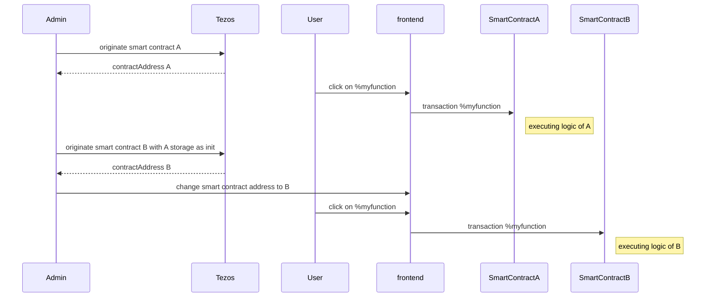
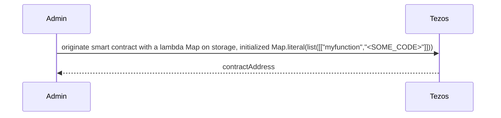
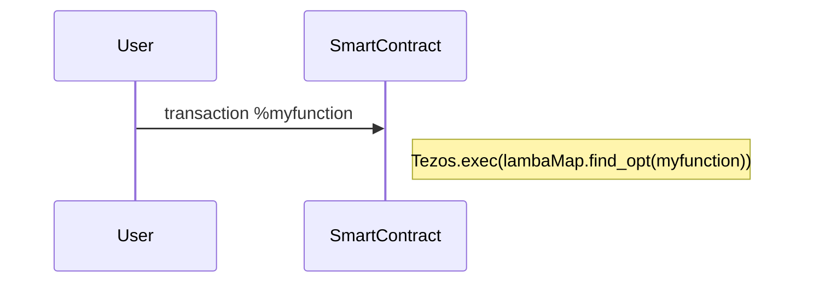
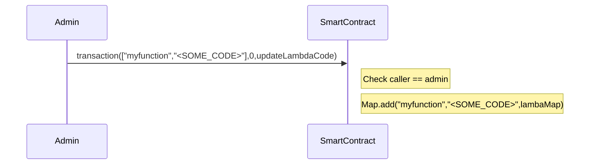
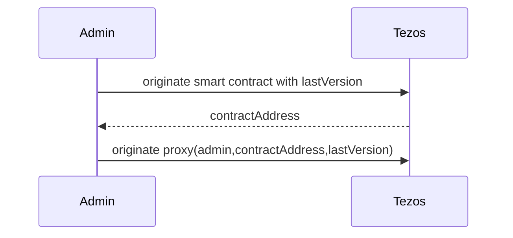
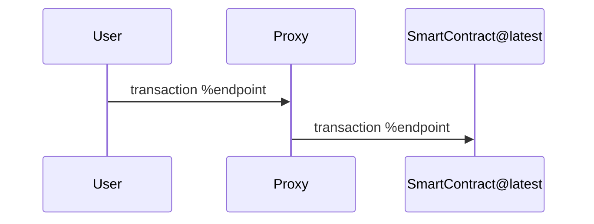
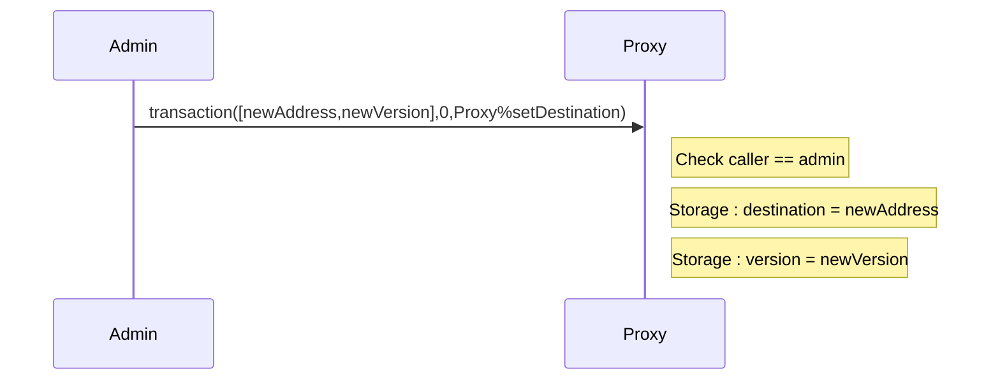
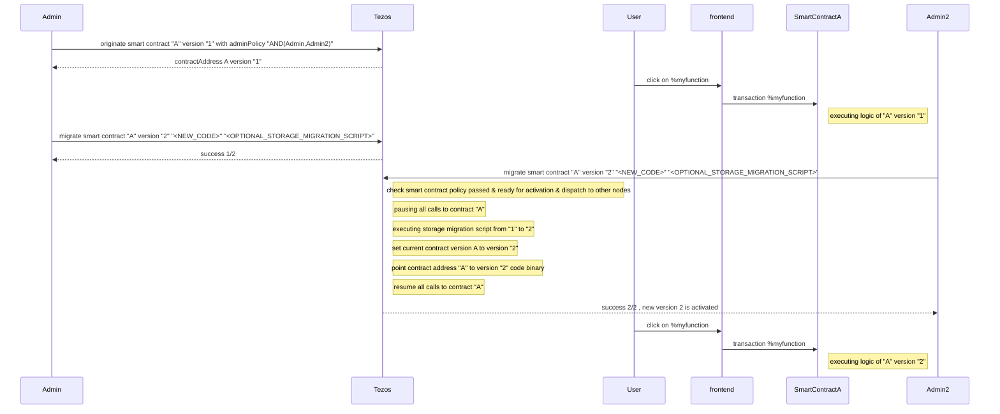

Training dapp n°4
===

# :point_up:  Upgradable Poke game

Previously, you learned how to use tickets and don't mess up with it.
In this third session, you will enhance your skills on :
- upgrading a smart contract with proxy
- upgrading a smart contract with lambda function code

As you maybe know, smart contracts are immutable but in real life, applications are not and evolve. During the past several years, bugs and vulnerabilities in smart contracts caused millions of dollars to get stolen or lost forever. Such cases may even require manual intervention in blockchain operation to recover the funds.

Let's see 2 tricks that allow to upgrade a contract

# :memo: Prerequisites

There is nothing more than you needed on first session : https://github.com/marigold-dev/training-dapp-1#memo-prerequisites

Get your code from the session 3 or the solution [here](https://github.com/marigold-dev/training-dapp-3/tree/main/solution)

# :arrows_clockwise: Upgrades

As everyone knows, one feature of blockchain is to keep immutable code on a block. This allows transparency, traceability and trustlessness.

But application lifecycle implies to evolve and upgrade code to fix bug or bring functionalities. So how can we do it ?

> https://gitlab.com/tezos/tzip/-/blob/master/proposals/tzip-18/tzip-18.md

> Note : All below solutions break in a wait the fact that a smartcontract is immutable. We can preserve in a way **Trust** if the upgrade process has some security and authenticity around it. Like the first time an admin deploys a smartcontract, any user should be able to trust the code reading it with free read access, the same should apply to the upgrade process (notification of new code version, admin identification, whitelisted auditor reports, ...). To resume, if you really want to avoid DEVOPS centralization, you are about to create a DAO with a voting process amongs some selected users/administrators in order to deploy the new version of the smartcontract ... but let's simplify and talk here only about classical centralized admin deployment

## Naive approach

One can deploy a new version of the smart contract and do a redirection to the new address on front end side 

Complete flow

| Pros | Cons |
| --   |   -- |
| Easiest to do | Old contract remains active, so do bugs. Need to really get rid off it |
|  | Need to migrate old storage, can cost a lot of money or even be too big to copy at init time|
|  | Need to sync/update frontend at each backend migration |
|  | Lose reference to previous contract address, can lead to issues with other dependent contracts |

## Stored Lambda function

This time, the code will be on the storage and being executed at runtime

Init

Interaction

Administration

### Pros/Cons

| Pros | Cons |
| --   |   -- |
| No more migration of code and storage. Update the lambda function code that is on existing storage | If we want also storage, we need to store all in bytes PACKING/UNPACKING and we lose all type checking |
| keep same contract address | IDE or tools do not work anymore on lambda code. Michelson does not protect us from some kinds of mistakes anymore |
|  | Unexpected changes can cause other contract callers to fail, we lose interface benefits |
|  | Harder to audit and trace, can lead to really big security nd Trust issues |
|  | Storing everything as bytes is limited to PACK-able types like nat, string, list, set, map |

### Implementation

>

## Proxy pattern

Goal is to have a proxy contract that maintain the application lifecycle, it is an enhancement of previous naive solution

Init

Interaction

Administration

> Note : 2 location choices for the storage :
> - at proxy level : storage stays unique and immutable
> - at end-contract level : storage is new at each new version and need to be migrated

### Pros/Cons

| Pros | Cons |
| --   |   -- |
| Migration is transparent for frontend | smart contract code `Tezos.SENDER` will always refer to the proxy, so need to be careful |
| if storage is unchanged, we can keep storage at proxy level without cost | If storage changes, need to migrate storage from old contract to new contract and it costs money and having storage at proxy lvele is not more possible |
| keep same contract address | If contract interface changed, we need to re-originating the proxy |

### Implementation

> Full example can be found here : https://github.com/smart-chain-fr/tzip18/blob/main/contract/proxy.mligo

## Alternative : Composability

Managing a monolithic smartcontract like a microservice can reduce the problem, on the other side it increase complexity and application lifecycle on OPS side

## Final thought : New Proposition for TZIP-18

Copy Hyperledger Fabric migration feature.

It is comparable to the naive approach combined with internal proxy except that the proxy is managed by Tezos node and requires no more user manual operations

Few changes to consider :
- contract aliases are no more local with CLI but globally known on the network. Aliases are unique and maintained by chain
- during migration, all nodes knows which binary of the code to run depending of the current code version associated to the smart contract. So we have a notion of smartcontract definition (name,version,code,adminPolicies). (Can be stored on the global table by only in WRITABLE depending of smartcontract policies ?)
- smart contracts have admin policies defining who can deploy a new version. Like DAO , it can be a multisig signature of required n among m signatures to actually activate the new version `tezos-client migrate contract "A" "2.0" "<NEW_CODE>" "<OPTIONAL_STORAGE_MIGRATION_SCRIPT>" `
- also admin policies might be updatable too. `tezos-client update contract-policy "A" "OR(Admin,Admin2)" ` . We can imagine new roles to do smart contract migration, edit smart contract policies, etc ... a RBAC system
- how to revert ? It is not possible to revert, instead, deploy the source code of previous version with a reverse storage migration script. It will increment the smart contract version anyway

| Pros | Cons |
| --   |   -- |
| Easiest for DEVOPS | Once could try to take lot of contract alias names (i.e kinda DNS system) but it will cost money and added value is not so big |
| Cheap, as storage does not move | use jq as new storage migration language ? |
|  | Need to clearly define governance policies for upgrading contracts at first deployment |

# :palm_tree: Conclusion :sun_with_face:

Now, you are able to upgrade deployed contracts
