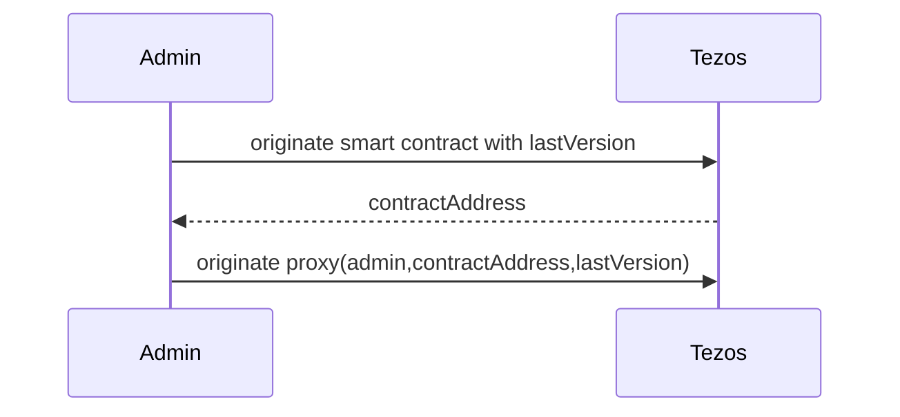
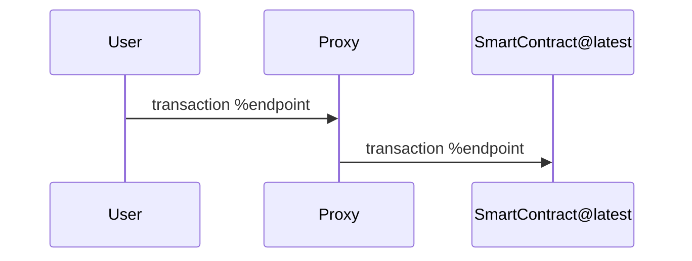
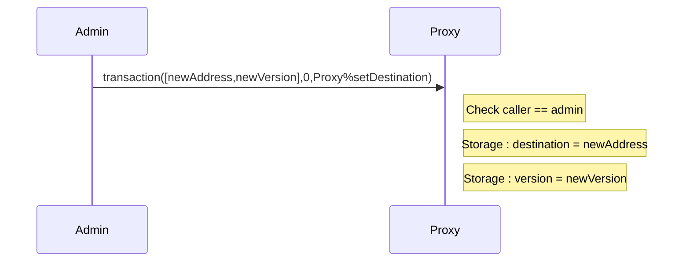
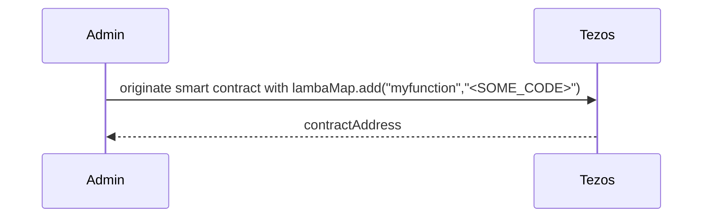
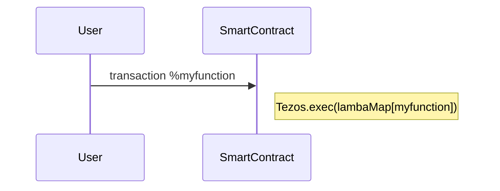
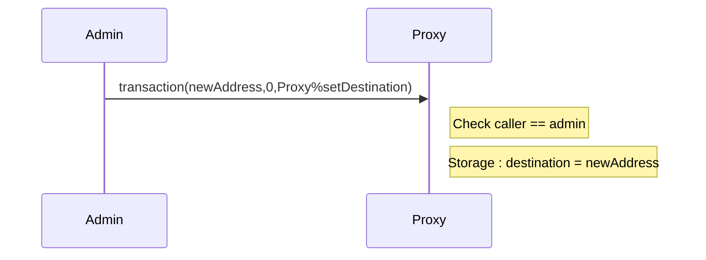

Training dapp n°4
===

# :point_up:  Upgradable Poke game

Previously, you learned how to do inter-contract calls, use view and do unit testing.
In this third session, you will enhance your skills on :
- upgrading a smart contract and store function code

As you maybe know, smart contracts are immutable but in real life, applications are not and evolve. Let's see 2 tricks that allow to upgrade a contract

# :memo: Prerequisites

There is nothing more than you needed on first session : https://github.com/marigold-dev/training-dapp-1#memo-prerequisites

Get your code from the session 3 or the solution [here](https://github.com/marigold-dev/training-dapp-3/tree/main/solution)

# :arrows_clockwise: Upgrades

As everyone knows, one feature of blockchain is to keep immutable code on a block. This allows transparency, traceability and trustlessness.

But application lifecycle implies to evolve and upgrade code to fix bug or bring functionalities. So how can we do it ?

> https://gitlab.com/tezos/tzip/-/blob/master/proposals/tzip-18/tzip-18.md

## Naive approach

Ones can deploy a new version of the smart contract and do a redirection to the new address on front end side 

| Pros | Cons |
| --   |   -- |
| Easy to do | Old contract remains active, so do bugs |
|  | Need to migrate old storage, cost money |
|  | Need to update frontend at each backend migration |

## Proxy pattern

Goal is to have a proxy contract that maintain the application lifecycle, it is an enhancement of previous naive solution

Init

Interaction

Administration

### Pros/Cons

| Pros | Cons |
| --   |   -- |
| Migration is transparent for frontend | smart contract code `Tezos.SENDER` will always refer to the proxy |
|  | Need to migrate old storage, cost money |
|  | Wrap transaction params (endpointNameToCall,bytes) |

### Implementation

> Full example can be found here : https://github.com/smart-chain-fr/tzip18/blob/main/contract/proxy.mligo

## Stored Lambda function

This time, the code will be on the storage and being executed at runtime

Init

Interaction

Administration

### Pros/Cons

| Pros | Cons |
| --   |   -- |
| No migration of code and storage | IDE or tools do not work anymore on lambda code |
|  | Unexpected changes can cause other contract callers to fail |
|  | Harder to audit and trace |

//TODO TZIP-18 proposition like Hyperledger one. Call contract "ALIAS" with "VERSION" from "ADMIN address", protocol knows where is the address of the code version to call, like protocol is having an indexer of similar contract from same Admin and is able to execute the good SOURCE CODE.
When migration is asked : tezos-client migrate contract MY_CONTRACT to version VERSION_X.Y.Z etc ...
OR
use the global table .. ? registred there the last HASH version of deplyed contracts ? ... ? Who can update this table ???

### Implementation

>

# :palm_tree: Conclusion :sun_with_face:

Now, you are able to upgrade deployed contracts
